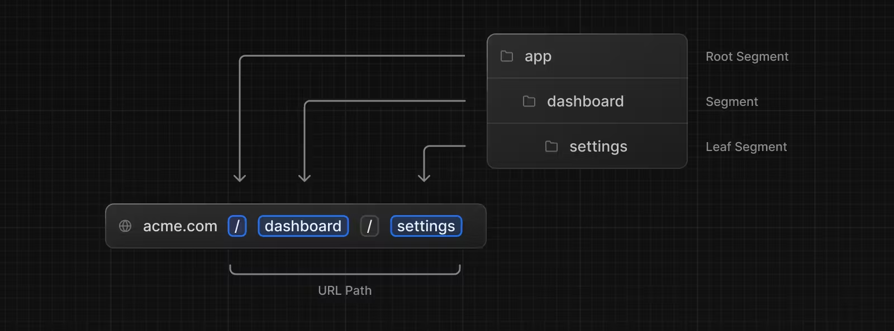
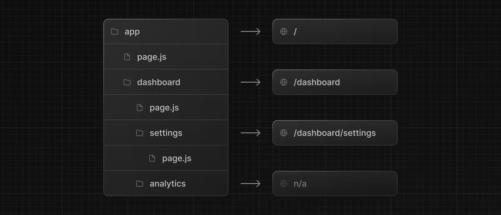

# 경로 정의

> 계속하기 전에 [라우팅 기본 사항](https://nextjs.org/docs/app/building-your-application/routing) 페이지를 읽어보는 것이 좋습니다.

이 페이지에서는 Next.js 애플리케이션에서 경로를 정의하고 구성하는 방법을 안내합니다.

## Routes 생성

Next.js는 폴더를 사용하여 경로를 정의하는 파일 시스템 기반 라우터를 사용한다.

각 폴더는 URL 세그먼트에 매핑되는 경로 세그먼트를 나타냅니다. 중첩된 경로를 만들려면 폴더를 서로 중첩하면 된다.



특별한 `page.js` 파일은 경로 세그먼트에 공개적으로 접근할 수 있도록 하는데 사용된다.



예시에서 `/dashboard/analytics` URL 경로는 `page.js`파일과 일치하는 것이 없기 때문에 공개적으로 접근이 불가능하다. 이 폴더는 components, stylesheets, images, 혹은 다른 같은 장소에 배치된 파일들을 저장하는데 사용될 수 있다.

> 알아두면 좋은 점: 특수 파일에는 `.js`, `.jsx` 또는 `.tsx` 파일 확장자를 사용할 수 있습니다.

## UI 생성하기

[특별한 파일 컨벤션](https://nextjs.org/docs/app/building-your-application/routing)들은 각 라우트 새그먼트를 위해 생성된다. 가장 일반적인 것은 경로에 유니크한 UI를 보여주는 페이지들, 그리고 여러 경로에서 공유되는 UI를 표시하는 [레이아웃](https://nextjs.org/docs/app/building-your-application/routing/pages-and-layouts#layouts)이다.

예를 들어, 첫 페이지를 생성할 때, `app` 디렉토리에 `page.js` 파일을 추가하고, React Component를 export하자

```tsx
// app/page.tsx

export default function Page() {
  return <h1>Hello, Next.js!</h1>;
}
```
