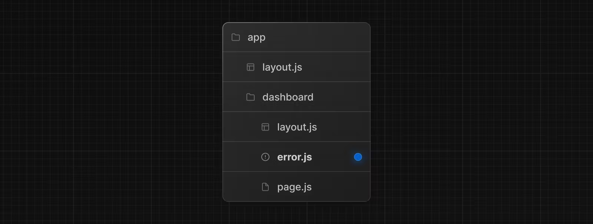
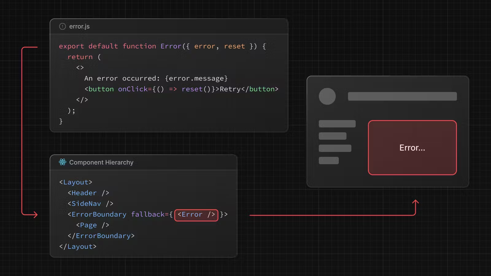
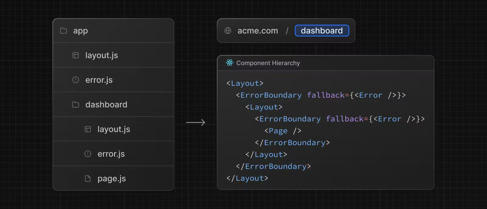

# 오류 처리 (Error Handling)

`error.js` 파일 규칙을 사용하면 [중첩된 경로](https://nextjs.org/docs/app/building-your-application/routing#nested-routes)에서 예기치 않은 런타임 오류를 적절하게 처리할 수 있습니다.

- [React Error Boundary](https://react.dev/reference/react/Component#catching-rendering-errors-with-an-error-boundary)에서 경로 세그먼트와 중첩된 하위 항목을 자동으로 래핑합니다.
- 세분성을 조정하기 위해 파일 시스템 계층 구조를 사용하여 특정 세그먼트에 맞는 오류 UI를 만듭니다.
- 나머지 애플리케이션 기능을 유지하면서 영향을 받은 세그먼트에 대한 오류를 격리합니다.
- 전체 페이지를 다시 로드하지 않고 오류 복구를 시도하는 기능을 추가합니다.

경로 세그먼트 내에 `error.js` 파일을 추가하고 React 컴포넌트를 내보내 오류 UI를 만듭니다.



```tsx
// app/dashboard/error.tsx

"use client"; // Error components must be Client Components

import { useEffect } from "react";

export default function Error({
  error,
  reset,
}: {
  error: Error & { digest?: string };
  reset: () => void;
}) {
  useEffect(() => {
    // Log the error to an error reporting service
    console.error(error);
  }, [error]);

  return (
    <div>
      <h2>Something went wrong!</h2>
      <button
        onClick={
          // Attempt to recover by trying to re-render the segment
          () => reset()
        }
      >
        Try again
      </button>
    </div>
  );
}
```

## `error.js` 작동 방식



- `error.js`는 중첩된 하위 세그먼트 또는 `page.js` 컴포넌트를 래핑하는 [React Error Boundary](https://react.dev/reference/react/Component#catching-rendering-errors-with-an-error-boundary)를 자동으로 생성합니다.
- `error.js` 파일에서 내보낸 React 컴포넌트가 대체(fallback) 컴포넌트로 사용됩니다.
- 오류 경계 내에서 오류가 발생하면 오류가 포함되고 대체(fallback) 컴포넌트가 렌더링됩니다.
- 대체(fallback) 오류 컴포넌트가 활성화되면 오류 경계 위의 레이아웃은 상태를 유지하고 대화형을 유지하며 오류 컴포넌트는 오류를 복구하는 기능을 표시할 수 있습니다.

## 오류 복구

오류의 원인은 일시적일 수 있습니다. 이러한 경우 다시 시도하면 문제가 해결될 수도 있습니다.

오류 컴포넌트는 `reset()` 함수를 사용하여 사용자에게 오류 복구를 시도하라는 메시지를 표시할 수 있습니다. 실행되면 함수는 오류 경계의 내용을 다시 렌더링하려고 시도합니다. 성공하면 대체(fallback) 오류 컴포넌트가 다시 렌더링된 결과로 대체됩니다.

```tsx
"use client";

export default function Error({
  error,
  reset,
}: {
  error: Error & { digest?: string };
  reset: () => void;
}) {
  return (
    <div>
      <h2>Something went wrong!</h2>
      <button onClick={() => reset()}>Try again</button>
    </div>
  );
}
```

### 중첩된 경로

[특수 파일](https://nextjs.org/docs/app/building-your-application/routing#file-conventions)을 통해 생성된 React 컴포넌트는 [특정 중첩 계층 구조](https://nextjs.org/docs/app/building-your-application/routing#component-hierarchy)로 렌더링됩니다.

예를 들어,`layout.js` 및 `error.js` 파일을 모두 포함하는 두 개의 세그먼트가 있는 중첩 경로는 다음과 같은 단순화된 구성 요소 계층 구조에서 렌더링됩니다.



중첩된 컴포넌트 계층 구조는 중첩된 경로에서 `error.js` 파일의 동작에 영향을 미칩니다.

- 오류는 가장 가까운 상위 오류 경계(Error boundary)까지 표시됩니다. 이는 `error.js` 파일이 중첩된 모든 하위 세그먼트에 대한 오류를 처리한다는 의미입니다. 경로의 중첩 폴더에서 서로 다른 수준에 `error.js` 파일을 배치하면 다소 세분화된 오류 UI를 얻을 수 있습니다.
- 오류 경계는 해당 레이아웃 컴포넌트 내에 중첩되어 있으므로 `error.js` 경계는 동일한 세그먼트의 `layout.js` 컴포넌트에서 발생한 오류를 처리하지 않습니다.

## 레이아웃에서 에러 처리

`error.js` 경계는 동일한 세그먼트의 `layout.js` 또는 `template.js` 컴포넌트에서 발생하는 오류를 포착하지 않습니다. 이 [의도적 계층 구조](https://nextjs.org/docs/app/building-your-application/routing/error-handling#nested-routes)는 오류가 발생할 때 형제 경로(예: 탐색(navigation)) 간에 공유되는 중요한 UI를 표시하고 작동하도록 유지합니다.

특정 레이아웃이나 템플릿 내의 오류를 처리하려면 `error.js` 파일을 레이아웃 상위 세그먼트에 배치하세요.

루트 레이아웃이나 템플릿 내의 오류를 처리하려면 `global-error.js`라는 `error.js`의 변형을 사용하세요.

## 루트 레이아웃에서 에러 처리

루트 `app/error.js` 경계는 루트 `app/layout.js` 또는 `app/template.js` 구성 요소에서 발생한 오류를 포착하지 않습니다.

이러한 루트 구성 요소의 오류를 구체적으로 처리하려면 루트 앱 디렉터리에 있는 `app/global-error.js`라는 `error.js` 변형을 사용하세요.

루트 `error.js`와 달리 `global-error.js` 오류 경계는 전체 애플리케이션을 감싸고 해당 fallback 컴포넌트가 활성화되면 루트 레이아웃을 대체합니다. 이 때문에 `global-error.js`는 자체 `<html>` 및 `<body>` 태그를 정의해야 한다는 점에 유의하는 것이 중요합니다.

`global-error.js`는 가장 세분화되지 않은 오류 UI이며 전체 애플리케이션에 대한 "포괄적(catch-all)" 오류 처리로 간주될 수 있습니다. 루트 컴포넌트는 일반적으로 덜 동적이며 다른 `error.js` 경계는 대부분의 오류를 포착하므로 자주 트리거될 가능성이 없습니다.

`global-error.js`가 정의된 경우에도 전 세계적으로 공유되는 UI 및 브랜딩을 포함하는 대체(fallback) 컴포넌트가 루트 레이아웃 내에서 렌더링될 루트 `error.js`를 정의하는 것이 좋습니다.

```tsx
// app/golbal-error.tsx

"use client";

export default function GlobalError({
  error,
  reset,
}: {
  error: Error & { digest?: string };
  reset: () => void;
}) {
  return (
    <html>
      <body>
        <h2>Something went wrong!</h2>
        <button onClick={() => reset()}>Try again</button>
      </body>
    </html>
  );
}
```

## 서버 에러 처리

서버 컴포넌트 내부에서 오류가 발생하면 Next.js는 오류 개체(프로덕션에서 민감한 오류 정보가 제거된)를 가장 가까운 `error.js` 파일에 오류 prop으로 전달합니다.

### 민감한 오류 정보 보호

프로덕션 중에 클라이언트에 전달되는 `Error` 개체에는 일반 `message`와 `digest` 속성만 포함됩니다.

이는 오류에 포함된 잠재적으로 민감한 세부 정보가 클라이언트에 유출되는 것을 방지하기 위한 보안 예방 조치입니다.

`message` 속성에는 오류에 대한 일반 메시지가 포함되어 있으며 `digest` 속성에는 서버 측 로그의 해당 오류와 일치시키는 데 사용할 수 있는 자동으로 생성된 오류 해시가 포함되어 있습니다.

개발 중에 클라이언트에 전달된 `Error` 개체는 직렬화되고 보다 쉬운 디버깅을 위해 원래 오류 `message`를 포함합니다.
