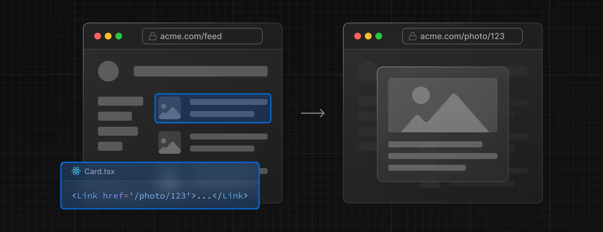
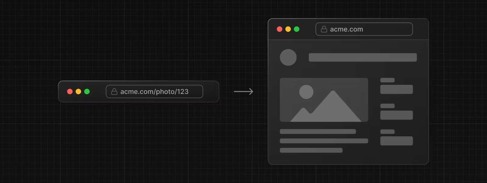
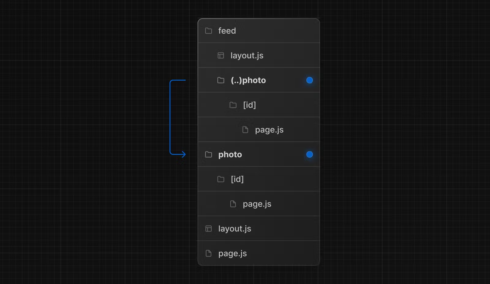
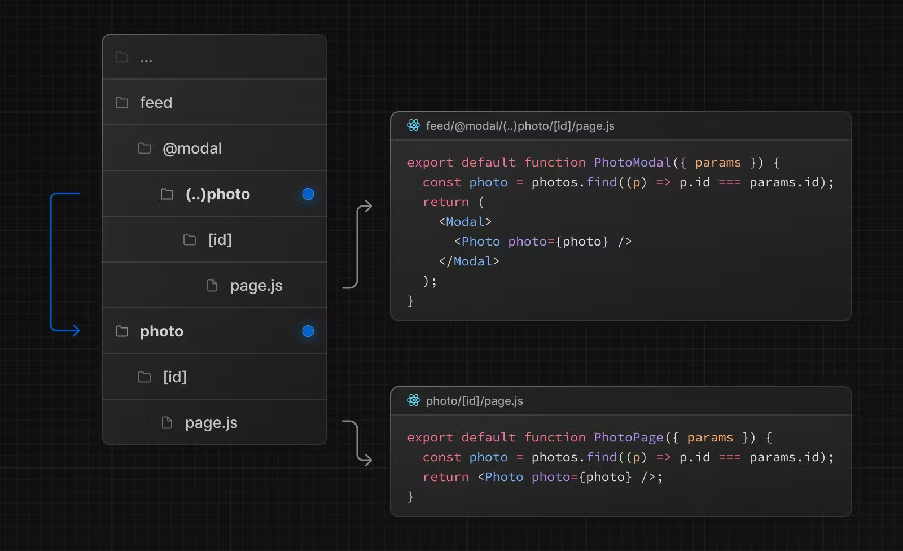

# 경로 차단

경로를 가로채면 현재 레이아웃 내 애플리케이션의 다른 부분에서 경로를 로드할 수 있습니다. 이 라우팅 패러다임은 사용자가 다른 컨텍스트로 전환하지 않고도 경로의 내용을 표시하려는 경우 유용할 수 있습니다.

예를 들어, 피드에서 사진을 클릭하면 피드에 오버레이되어 사진을 모달로 표시할 수 있습니다. 이 경우 Next.js는 `/photo/123` 경로를 가로채서 URL을 마스크하고 `/feed` 위에 오버레이합니다.

그러나 공유 가능한 URL을 클릭하거나 페이지를 새로 고쳐 사진으로 이동하면 모달 대신 전체 사진 페이지가 렌더링되어야 합니다. 경로 차단이 발생해서는 안 됩니다.

---

### 협약

경로 차단은 `(..)` 규칙으로 정의할 수 있는데, 이는 상대 경로 규칙 `../`과 유사하지만 세그먼트에 대한 것입니다.

당신은 사용할 수 있습니다:

- 같은 수준의 세그먼트를 일치시키려면 `(.)`
- 한 수준 위의 세그먼트와 일치시키려면 `(..)`
- 두 수준 위의 세그먼트와 일치시키려면 `(..)(..)`
- 루트 앱 디렉터리의 세그먼트를 일치시키려면 `(...)`

예를 들어, `(..)photo` 디렉토리를 생성하여 `feed` 세그먼트 내에서 `photo` 세그먼트를 가로챌 수 있습니다.

> `(..)` 규칙은 파일 시스템이 아닌 경로 세그먼트를 기반으로 한다는 점에 유의하세요.

---

## 예시

### 모달

가로채기 경로는 [병렬 경로](https://nextjs.org/docs/app/building-your-application/routing/parallel-routes)와 함께 사용하여 모달을 생성할 수 있습니다.

이 패턴을 사용하여 모달을 생성하면 다음과 같은 기능을 통해 모달 작업 시 몇 가지 일반적인 문제를 극복할 수 있습니다.

- URL을 통해 모달 콘텐츠를 공유 가능하게 만들기
- 모달을 닫는 대신 페이지를 새로 고칠 때 컨텍스트를 유지합니다.
- 이전 경로로 이동하는 대신 뒤로 탐색 시 모달을 닫습니다.
- 앞으로 탐색에서 모달을 다시 엽니다.

> 위의 예에서 `@modal`은 세그먼트가 아니라 슬롯이므로 사진 세그먼트에 대한 경로는 `(..)` 일치자를 사용할 수 있습니다. 이는 파일 시스템 수준이 두 개 더 높음에도 불구하고 `photo` 경로가 한 세그먼트 수준만 높다는 것을 의미합니다.

다른 예로는 전용 `/login` 페이지가 있는 동시에 상단 탐색 표시줄에서 로그인 모달을 열거나 측면 모달에서 장바구니를 여는 등이 있습니다.

가로채기 및 병렬 경로가 포함된 모달의 [예](https://github.com/vercel-labs/nextgram)를 확인하세요.
