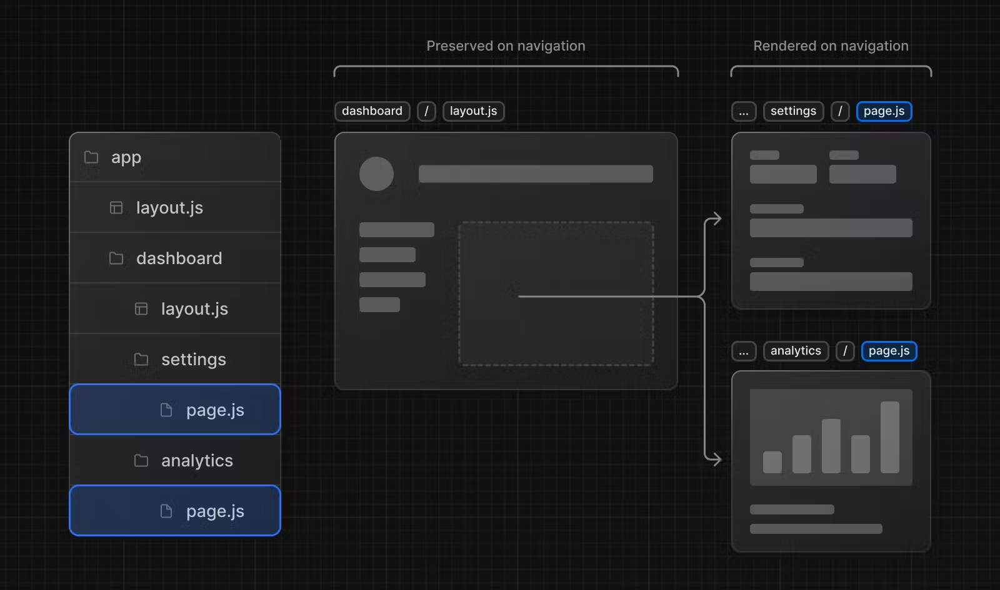

# Linking and Navigating

Next.js에서 경로 간을 탐색하는 방법에는 두 가지가 있습니다.

- [`Link` Component](https://nextjs.org/docs/app/building-your-application/routing/linking-and-navigating#link-component) 사용
- [`useRouter` Hook](https://nextjs.org/docs/app/building-your-application/routing/linking-and-navigating#userouter-hook) 사용

이 페이지에서는 `<Link>`, `useRouter()` 사용 방법을 살펴보고 탐색 작동 방식에 대해 자세히 알아봅니다.

---

## `<Link>` Component

`<Link>`는 HTML `<a>` 태그를 확장하여 경로 간 [prefetching](https://nextjs.org/docs/app/building-your-application/routing/linking-and-navigating#1-prefetching) 및 클라이언트 측 탐색을 제공하는 내장 구성 요소입니다. 이는 Next.js에서 경로 간을 탐색하는 기본 방법입니다.

`next/link`에서 가져오고 `href` 속성을 구성 요소에 전달하여 사용할 수 있습니다.

```tsx
// app/page.tsx

import Link from "next/link";

export default function Page() {
  return <Link href="/dashboard">Dashboard</Link>;
}
```

`<Link>`에 전달할 수 있는 다른 선택적 소품이 있습니다. 자세한 내용은 [API 참조](https://nextjs.org/docs/app/api-reference/components/link)를 참조하세요.

### 예시

#### 동적 세그먼트에 링크

[동적 세그먼트](https://nextjs.org/docs/app/building-your-application/routing/dynamic-routes)에 연결할 때 [템플릿 리터럴과 보간법](https://developer.mozilla.org/docs/Web/JavaScript/Reference/Template_literals)을 사용하여 링크 목록을 생성할 수 있습니다. 예를 들어 블로그 게시물 목록을 생성하려면 다음을 수행하세요.

```tsx
// app/blog/PostList.js

import Link from "next/link";

export default function PostList({ posts }) {
  return (
    <ul>
      {posts.map((post) => (
        <li key={post.id}>
          <Link href={`/blog/${post.slug}`}>{post.title}</Link>
        </li>
      ))}
    </ul>
  );
}
```

#### 활성 링크 확인

[`usePathname()`](https://nextjs.org/docs/app/api-reference/functions/use-pathname)을 사용하여 링크가 활성 상태인지 확인할 수 있습니다. 예를 들어 활성 링크에 클래스를 추가하려면 현재 `pathname` 이름이 링크의 `href`와 일치하는지 확인할 수 있습니다.

```tsx
// app/components/links.tsx

"use client";

import { usePathname } from "next/navigation";
import Link from "next/link";

export function Links() {
  const pathname = usePathname();

  return (
    <nav>
      <ul>
        <li>
          <Link className={`link ${pathname === "/" ? "active" : ""}`} href="/">
            Home
          </Link>
        </li>
        <li>
          <Link
            className={`link ${pathname === "/about" ? "active" : ""}`}
            href="/about"
          >
            About
          </Link>
        </li>
      </ul>
    </nav>
  );
}
```

#### `id`로 스크롤

Next.js 앱 라우터의 기본 동작은 새 경로의 맨 위로 스크롤하거나 앞뒤 탐색을 위해 스크롤 위치를 유지하는 것입니다.

탐색 시 특정 `id`로 스크롤하려면 `#` 해시 링크를 URL에 추가하거나 해시 링크를 `href` 속성에 전달할 수 있습니다. 이는 `<Link>`가 `<a>` 요소로 렌더링되기 때문에 가능합니다.

```tsx
<Link href="/dashboard#settings">Settings</Link>

// Output
<a href="/dashboard#settings">Settings</a>
```

#### 스크롤 복원 비활성화

Next.js 앱 라우터의 기본 동작은 새 경로의 맨 위로 스크롤하거나 앞뒤 탐색을 위해 스크롤 위치를 유지하는 것입니다. 이 동작을 비활성화하려면 `<Link>` 컴포넌트에 `scroll={false}`를 전달하거나 `router.push()` 또는 `router.replace()`에 `scroll: false`를 전달하면 됩니다.

```tsx
// next/link
<Link href="/dashboard" scroll={false}>
  Dashboard
</Link>
```

```tsx
// useRouter
import { useRouter } from "next/navigation";

const router = useRouter();

router.push("/dashboard", { scroll: false });
```

---

## useRouter() Hook

`useRouter` hook를 사용하면 프로그래밍 방식으로 경로를 변경할 수 있습니다.

이 hook은 클라이언트 컴포넌트 내에서만 사용할 수 있으며 `next/navigation`에서 가져옵니다.

```tsx
// app/page.js

"use client";

import { useRouter } from "next/navigation";

export default function Page() {
  const router = useRouter();

  return (
    <button type="button" onClick={() => router.push("/dashboard")}>
      Dashboard
    </button>
  );
}
```

`useRouter` 메소드의 전체 목록은 [API 참조](https://nextjs.org/docs/app/api-reference/functions/use-router)를 확인하세요.

> 권장사항: ` useRouter` 사용에 대한 특정 요구사항이 없는 한 `<Link>` 구성요소를 사용하여 경로 간을 탐색하세요.

---

## 라우팅 및 탐색 작동 방식

앱 라우터는 라우팅 및 탐색을 위해 하이브리드 접근 방식을 사용합니다. 서버에서 애플리케이션 코드는 경로 세그먼트별로 자동으로 코드 분할됩니다. 그리고 클라이언트에서 Next.js는 경로 세그먼트를 [prefetches](https://nextjs.org/docs/app/building-your-application/routing/linking-and-navigating#1-prefetching)하고 [caches](https://nextjs.org/docs/app/building-your-application/routing/linking-and-navigating#2-caching) 합니다. 즉, 사용자가 새 경로로 이동할 때 브라우저는 페이지를 다시 로드하지 않고 변경된 경로 세그먼트만 다시 렌더링하여 탐색 경험과 성능을 향상시킵니다.

### 1. 프리페칭 (Prefetching)

prefetching은 사용자가 경로를 방문하기 전에 백그라운드에서 경로를 미리 로드하는 방법입니다.

Next.js에서 경로를 미리 가져오는 방법에는 두 가지가 있습니다.

- `<Link>` 컴포넌트: 경로가 사용자 뷰포트에 표시되면 자동으로 미리 가져옵니다. 프리페치는 페이지가 처음 로드될 때 또는 스크롤을 통해 표시될 때 발생합니다.
- `router.prefetch()`: `useRouter` 후크는 프로그래밍 방식으로 경로를 프리페치하는 데 사용할 수 있습니다.

`<Link>`의 prefetching 동작은 정적 경로와 동적 경로에 따라 다릅니다.

- [정적 경로](https://nextjs.org/docs/app/building-your-application/rendering/server-components#static-rendering-default): `prefetch`의 기본값이 `true`입니다. 전체 경로가 프리페치되고 캐시됩니다.
- [동적 경로](https://nextjs.org/docs/app/building-your-application/rendering/server-components#dynamic-rendering): `prefetch`의 기본값은 자동입니다. 첫 번째 `loading.js` 파일이 프리페치되고 30초 동안 캐시될 때까지 공유 레이아웃만 다운됩니다. 이렇게 하면 전체 동적 경로를 가져오는 비용이 줄어들고 사용자에게 더 나은 시각적 피드백을 제공하기 위해 [즉시 로드 상태](https://nextjs.org/docs/app/building-your-application/routing/loading-ui-and-streaming#instant-loading-states)를 표시할 수 있습니다.

`prefetch` prop을 `false`로 설정함으로 prefetching을 허용하지 않을 수 있습니다.

자세한 내용은 [`<Link>` API 참조](https://nextjs.org/docs/app/api-reference/components/link)를 확인하세요.

> 알아두면 좋은 점:
>
> - prefetching은 개발 중에는 활성화되지 않고 프로덕션에서만 활성화됩니다.

### 2. 캐싱

Next.js에는 [라우터 캐시](https://nextjs.org/docs/app/building-your-application/data-fetching/fetching-caching-and-revalidating#caching-data#router-cache)라는 메모리 내 클라이언트측 캐시가 있습니다. 사용자가 앱을 탐색할 때 [prefetched](https://nextjs.org/docs/app/building-your-application/routing/linking-and-navigating#1-prefetching)된 경로 세그먼트와 방문한 경로의 React Server 구성 요소 페이로드가 캐시에 저장됩니다.

이는 탐색 시, 서버에 새로운 요청을 하는 대신 캐시를 최대한 재사용하여 요청 수와 전송되는 데이터 수를 줄여 성능을 향상한다는 의미입니다.

[라우터 캐시](https://nextjs.org/docs/app/building-your-application/data-fetching/fetching-caching-and-revalidating#caching-data)의 작동 방식과 구성 방법에 대해 자세히 알아보세요.

### 3. 부분 렌더링

부분 렌더링은 클라이언트에서 탐색을 다시 렌더링할 때 변경되는 경로 세그먼트만 의미하며 모든 공유 세그먼트는 보존됩니다.

예를 들어, 두 형제 경로인 `/dashboard/settings` 및 `/dashboard/analytics` 사이를 탐색할 때 `settings` 및 `analytics` 페이지가 렌더링되고 공유 `dashboard` 레이아웃이 유지됩니다.



부분 렌더링이 없으면 탐색할 때마다 전체 페이지가 서버에서 다시 렌더링됩니다. 변경된 세그먼트만 렌더링하면 전송되는 데이터의 양과 실행 시간이 줄어들어 성능이 향상됩니다.

### 4. 소프트 탐색 (Soft Navigation)

기본적으로 브라우저는 페이지 간 하드 탐색을 수행합니다. 이는 브라우저가 페이지를 다시 로드하고 앱의 `useState` hook과 같은 React 상태와 사용자의 스크롤 위치 또는 초점이 맞춰진 요소와 같은 브라우저 상태를 재설정한다는 것을 의미합니다. 그러나 Next.js에서 앱 라우터는 소프트 탐색을 사용합니다. 이는 React가 React와 브라우저 상태를 유지하면서 변경된 세그먼트만 렌더링하며 전체 페이지를 다시 로드하지 않는다는 것을 의미합니다.

### 5. 앞뒤 탐색 (Back and Forward Navigation)

기본적으로 Next.js는 앞뒤 탐색을 위한 스크롤 위치를 유지하고 [라우터 캐시](https://nextjs.org/docs/app/building-your-application/data-fetching/fetching-caching-and-revalidating#caching-data)의 경로 세그먼트를 재사용합니다.
