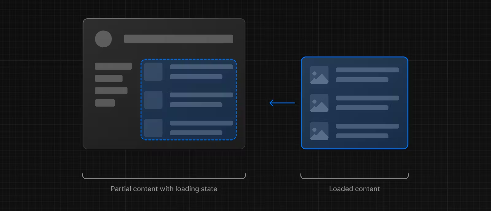
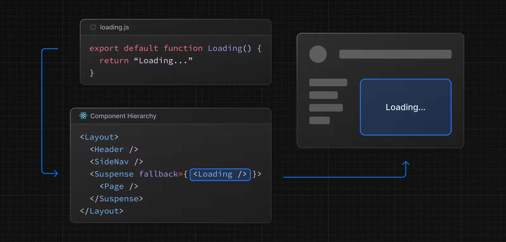
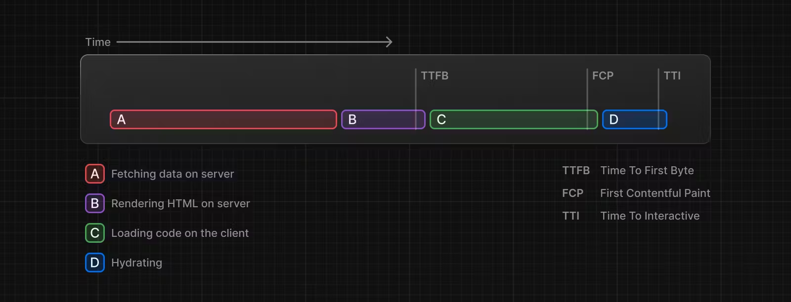
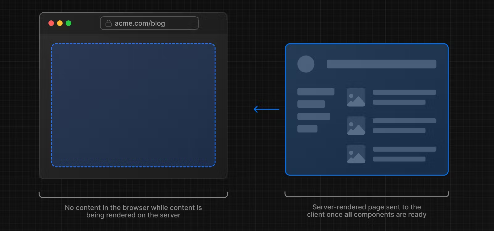
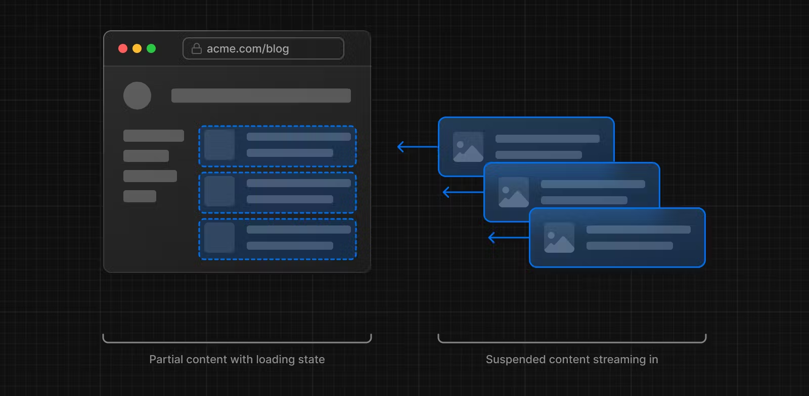
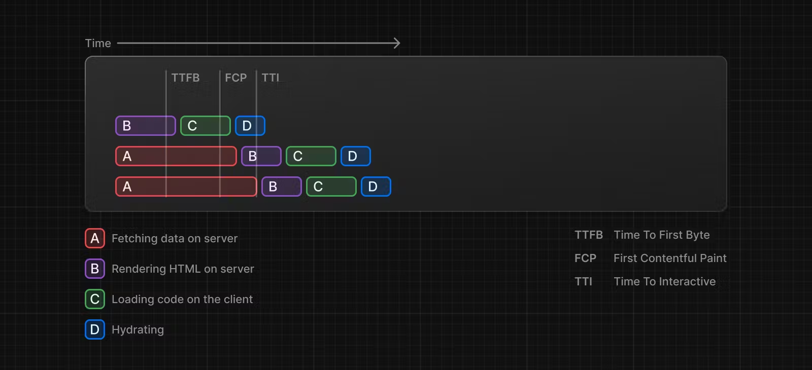

# 로딩 UI 및 스트리밍

특수 파일 `loading.js`는 [React Suspense](https://react.dev/reference/react/Suspense)를 사용하여 의미 있는 로딩 UI를 만드는 데 도움이 됩니다. 이 규칙을 사용하면 경로 세그먼트의 콘텐츠가 로드되는 동안 서버에서 [즉시 로딩 상태](https://nextjs.org/docs/app/building-your-application/routing/loading-ui-and-streaming#instant-loading-states)를 표시할 수 있습니다. 렌더링이 완료되면 새 콘텐츠가 자동으로 교체됩니다.



---

## 즉시 로딩 상태

즉시 로딩 상태는 탐색 시 즉시 표시되는 대체 UI입니다. 스켈레톤 및 스피너와 같은 로딩 표시기나 표지 사진, 제목 등과 같은 향후 화면의 작지만 의미 있는 부분을 사전 렌더링할 수 있습니다. 이를 통해 사용자는 앱이 응답하고 있음을 이해하고 더 나은 사용자 경험을 제공할 수 있습니다.

폴더 안에 `loading.js` 파일을 추가하여 로딩 상태를 만듭니다.


```tsx
// app/dashboard/loading.tsx

export default function Loading() {
  // You can add any UI inside Loading, including a Skeleton.
  return <LoadingSkeleton />;
}
```

같은 폴더에서 `loading.js`는 `layout.js` 안에 중첩됩니다. `page.js` 파일과 그 아래의 모든 하위 항목을 `<Suspense>` 경계에 자동으로 래핑합니다.



> 알아두면 좋은 점:
>
> - [서버 중심 라우팅](https://nextjs.org/docs/app/building-your-application/routing/linking-and-navigating#how-routing-and-navigation-works)을 사용하더라도 탐색은 즉각적입니다.
> - 탐색은 중단 가능합니다. 즉, 경로를 변경할 때 다른 경로로 이동하기 전에 경로의 콘텐츠가 완전히 로드될 때까지 기다릴 필요가 없습니다.
> - 새 경로 세그먼트가 로드되는 동안 공유 레이아웃은 대화형으로 유지됩니다.

> 권장사항: Next.js가 이 기능을 최적화하므로 경로 세그먼트(레이아웃 및 페이지)에 loading.js 규칙을 사용하세요.

## Suspense를 이용한 스트리밍

`loading.js` 외에도 자체 UI 구성 요소에 대한 Suspense Boundaries를 수동으로 생성할 수도 있습니다. 앱 라우터는 [Node.js 및 Edge 런타임](https://nextjs.org/docs/app/building-your-application/rendering/edge-and-nodejs-runtimes) 모두에 대해 [Suspense](https://react.dev/reference/react/Suspense)를 사용한 스트리밍을 지원합니다.

### 스트리밍이란 무엇인가?

React 및 Next.js에서 스트리밍이 작동하는 방식을 배우려면 Server-Side Rendering (SSR)과 그 제한 사항을 이해하는 것이 도움이 됩니다.

SSR을 사용하면 사용자가 페이지를 보고 상호 작용하기 전에 완료해야 하는 일련의 단계가 있습니다.

1. 먼저, 특정 페이지의 모든 데이터를 서버에서 가져옵니다.
2. 그런 다음 서버는 페이지의 HTML을 렌더링합니다.
3. 페이지의 HTML, CSS 및 JavaScript가 클라이언트로 전송됩니다.
4. 비대화형 사용자 인터페이스는 생성된 HTML 및 CSS를 사용하여 표시됩니다.
5. 마지막으로 React는 사용자 인터페이스를 대화형으로 만들기 위해 [hydrates](https://react.dev/reference/react-dom/client/hydrateRoot#hydrating-server-rendered-html)을 합니다.



이러한 단계는 순차적이며 차단됩니다. 즉, 모든 데이터를 가져온 후에만 서버가 페이지의 HTML을 렌더링할 수 있습니다. 그리고 클라이언트에서 React는 페이지의 모든 구성 요소에 대한 코드가 다운로드된 후에만 UI를 하이드레이션할 수 있습니다.

React 및 Next.js를 사용한 SSR은 사용자에게 비대화형 페이지를 가능한 한 빨리 표시하여 인지된 로딩 성능을 향상시키는 데 도움이 됩니다.



그러나 페이지가 사용자에게 표시되기 전에 서버에서 모든 데이터 가져오기가 완료되어야 하므로 여전히 속도가 느릴 수 있습니다.

스트리밍을 사용하면 페이지의 HTML을 더 작은 덩어리로 나누고 점진적으로 해당 덩어리를 서버에서 클라이언트로 보낼 수 있습니다.



이를 통해 UI가 렌더링되기 전에 모든 데이터가 로드될 때까지 기다리지 않고 페이지의 일부를 더 빨리 표시할 수 있습니다.

스트리밍은 각 구성 요소가 하나의 덩어리로 간주될 수 있기 때문에 React의 구성 요소 모델과 잘 작동합니다. 우선순위가 더 높거나(예: 제품 정보) 데이터에 의존하지 않는 구성 요소(예: 레이아웃)를 먼저 보낼 수 있으며 React는 더 일찍 수화(hydration)를 시작할 수 있습니다. 우선순위가 낮은 구성요소(예: 리뷰, 관련 제품)는 데이터를 가져온 후 동일한 서버 요청으로 전송할 수 있습니다.



스트리밍은 [TTFB(Time To First Byte)](https://web.dev/ttfb/) 및 [FCP(First Contentful Paint)](https://web.dev/first-contentful-paint/)를 줄일 수 있으므로 긴 데이터 요청으로 인해 페이지 렌더링이 차단되는 것을 방지하려는 경우 특히 유용합니다. 또한 특히 느린 장치에서 [TTI(Time to Interactive)](https://developer.chrome.com/en/docs/lighthouse/performance/interactive/)를 개선하는 데 도움이 됩니다.

### 예시

`<Suspense>`는 비동기 작업(예: 데이터 가져오기)을 수행하는 구성 요소를 래핑하고 해당 작업이 진행되는 동안 대체 UI(예: 스켈레톤, 스피너)를 표시한 다음 작업이 완료되면 구성 요소를 교체하는 방식으로 작동합니다.

```tsx
// app/dashboard/page.tsx

import { Suspense } from "react";
import { PostFeed, Weather } from "./Components";

export default function Posts() {
  return (
    <section>
      <Suspense fallback={<p>Loading feed...</p>}>
        <PostFeed />
      </Suspense>
      <Suspense fallback={<p>Loading weather...</p>}>
        <Weather />
      </Suspense>
    </section>
  );
}
```

Suspense를 사용하면 다음과 같은 이점을 얻을 수 있습니다.

1. 스트리밍 서버 렌더링 (Streaming Server Rendering) - 서버에서 클라이언트로 HTML을 점진적으로 렌더링합니다.
2. 선택적 수화 (Selective Hydration) - React는 사용자 상호 작용을 기반으로 어떤 구성 요소를 먼저 대화식으로 만들 것인지 우선 순위를 정합니다.

더 많은 Suspense 예제와 사용 사례를 보려면 [React 문서](https://react.dev/reference/react/Suspense)을 참조하세요.

### SEO

- Next.js는 UI를 클라이언트로 스트리밍하기 전에 [`generateMetadata`](https://nextjs.org/docs/app/api-reference/functions/generate-metadata) 내부의 데이터 가져오기가 완료될 때까지 기다립니다. 이렇게 하면 스트리밍된 응답의 첫 번째 부분에 `<head>` 태그가 포함됩니다.
- 스트리밍은 서버에서 렌더링되므로 SEO에 영향을 주지 않습니다. Google의 [모바일 친화성 테스트](https://search.google.com/test/mobile-friendly) 도구를 사용하면 페이지가 Google 웹 크롤러에 어떻게 표시되는지 확인하고 직렬화된 HTML([source](https://web.dev/rendering-on-the-web/#seo-considerations))을 볼 수 있습니다.

### 상태 코드 (Status Codes)

스트리밍할 때 요청이 성공했음을 알리기 위해 200 상태 코드가 반환됩니다.

예를 들어 [`redirect`](https://nextjs.org/docs/app/api-reference/functions/redirect) 또는 [`notFound`](https://nextjs.org/docs/app/api-reference/functions/not-found)를 사용하는 경우 서버는 스트리밍된 콘텐츠 자체 내에서 클라이언트에 오류나 문제를 계속 전달할 수 있습니다. 응답 헤더가 이미 클라이언트에 전송되었으므로 응답의 상태 코드를 업데이트할 수 없습니다. 이는 SEO에 영향을 미치지 않습니다.
