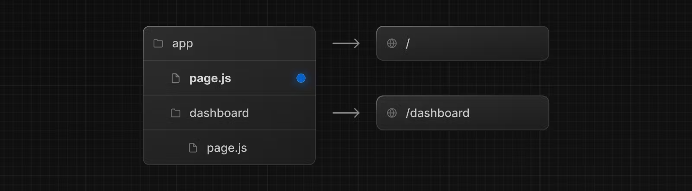
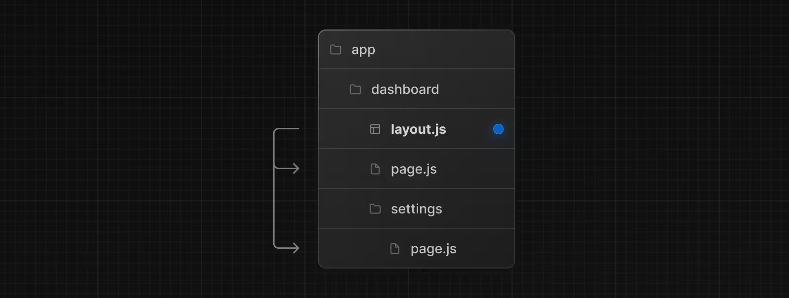
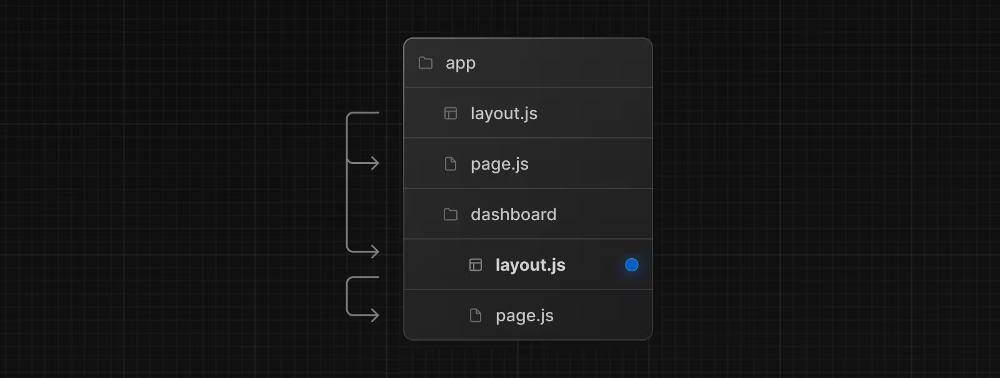
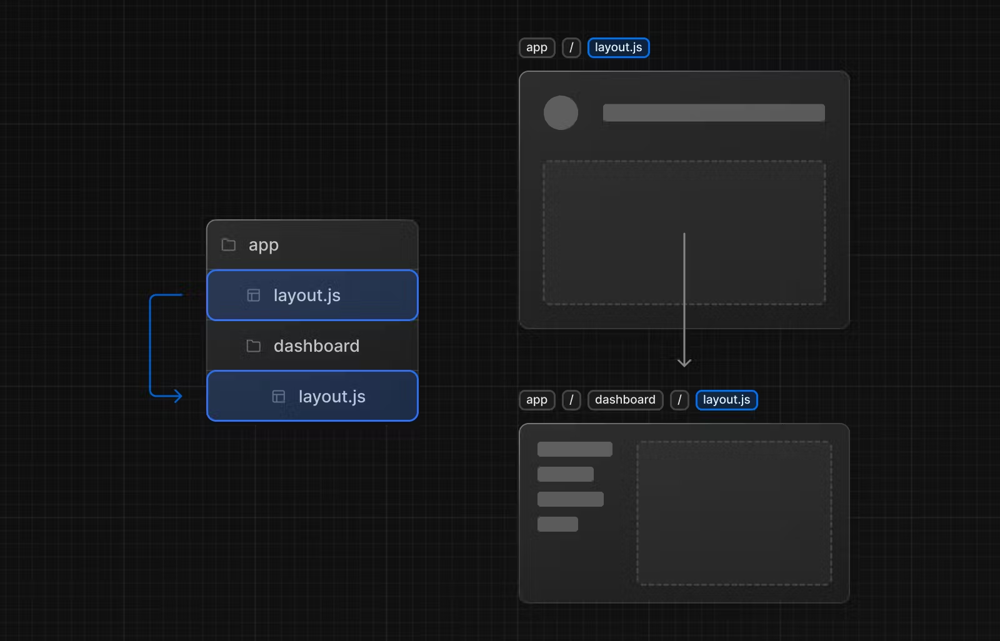

# 페이지와 레이아웃

> 계속하기 전에 [라우팅 기본 사항](https://nextjs.org/docs/app/building-your-application/routing) 및 [경로 정의 페이지](https://nextjs.org/docs/app/building-your-application/routing/defining-routes)를 읽어보는 것이 좋습니다.

Next.js 13 내부의 앱 라우터에는 [pages](https://nextjs.org/docs/app/building-your-application/routing/pages-and-layouts#pages), [shared layouts](https://nextjs.org/docs/app/building-your-application/routing/pages-and-layouts#layouts) 및 [templates](https://nextjs.org/docs/app/building-your-application/routing/pages-and-layouts#templates)을 쉽게 생성할 수 있는 새로운 파일 규칙이 도입되었습니다. 이 페이지는 Next.js 애플리케이션에서 이러한 특수 파일을 사용하는 방법을 안내합니다.

## 페이지

페이지는 경로에 고유한 UI입니다. `page.js` 파일에서 구성 요소를 내보내 페이지를 정의할 수 있습니다. 중첩된 폴더를 사용하여 [경로를 정의](https://nextjs.org/docs/app/building-your-application/routing/defining-routes)하고 해당 경로에 공개적으로 액세스할 수 있도록 `page.js` 파일을 만듭니다.

`app` 디렉터리 내에 `page.js` 파일을 추가하여 첫 번째 페이지를 만듭니다.



```tsx
// `app/page.tsx` is the UI for the `/` URL
export default function Page() {
  return <h1>Hello, Home page!</h1>;
}
```

```tsx
// `app/dashboard/page.tsx` is the UI for the `/dashboard` URL
export default function Page() {
  return <h1>Hello, Dashboard Page!</h1>;
}
```

> 알아두면 좋은 점 :
>
> - 페이지는 항상 경로 하위 트리 의 리프 입니다 .
> - `.js`, `.jsx`, 또는 `.tsx` 파일 확장자를 페이지에 사용할 수 있습니다.
> - 경로 세그먼트를 공개적으로 접근하려면 `page.js` 파일이 필요합니다 .
> - 페이지는 기본적으로 [서버 컴포넌트](https://nextjs.org/docs/app/building-your-application/rendering/server-components) 이지만 [클라이언트 컴포넌트](https://nextjs.org/docs/app/building-your-application/rendering/client-components)로 설정할 수 있습니다 .
> - 페이지는 데이터를 가져올 수 있습니다. 자세한 내용은 [데이터 가져오기](https://nextjs.org/docs/app/building-your-application/data-fetching) 섹션을 참조하세요 .

---

## 레이아웃

레이아웃은 여러 페이지에서 공유되는 UI입니다. 탐색 시 레이아웃은 상태를 유지하고 대화형을 유지하며 다시 렌더링되지 않습니다. 레이아웃은 [중첩](https://nextjs.org/docs/app/building-your-application/routing/pages-and-layouts#nesting-layouts)될 수도 있습니다.

`default`로 `layout.js` 파일에서 React component를 내보내는 방식으로 레이아웃을 정의할 수 있습니다. component는 렌더링 중에 하위 레이아웃(존재하는 경우) 또는 하위 페이지로 채워지는 `children` 속성을 허용해야 합니다.



```tsx
// app/dashboard/layout.tsx

export default function DashboardLayout({
  children, // will be a page or nested layout
}: {
  children: React.ReactNode;
}) {
  return (
    <section>
      {/* Include shared UI here e.g. a header or sidebar */}
      <nav></nav>

      {children}
    </section>
  );
}
```

> 알아두면 좋은 점:
>
> - 최상위 레이아웃을 [루트 레이아웃](https://nextjs.org/docs/app/building-your-application/routing/pages-and-layouts#root-layout-required)이라고 합니다. 이 필수 레이아웃은 애플리케이션의 모든 페이지에서 공유됩니다. 루트 레이아웃에는 `html` 및 `body` 태그가 포함되어야 합니다.
> - 모든 경로 세그먼트는 선택적으로 자체 [레이아웃](https://nextjs.org/docs/app/building-your-application/routing/pages-and-layouts#nesting-layouts)을 정의할 수 있습니다. 이러한 레이아웃은 해당 세그먼트의 모든 페이지에서 공유됩니다.
> - 경로의 레이아웃은 기본적으로 중첩됩니다. 각 상위 레이아웃은 React `children` prop을 사용하여 그 아래의 하위 레이아웃을 래핑합니다.
> - [경로 그룹](https://nextjs.org/docs/app/building-your-application/routing/route-groups)을 사용하여 공유 레이아웃 안팎에서 특정 경로 세그먼트를 선택할 수 있습니다.
> - 레이아웃은 기본적으로 [서버 컴포넌트](https://nextjs.org/docs/app/building-your-application/rendering/server-components)이지만 [클라이언트 컴포넌트](https://nextjs.org/docs/app/building-your-application/rendering/client-components)로 설정할 수 있습니다.
> - 레이아웃은 데이터를 가져올 수 있습니다. 자세한 내용은 [데이터 가져오기](https://nextjs.org/docs/app/building-your-application/data-fetching) 섹션을 참조하세요.
> - 상위 레이아웃과 해당 하위 레이아웃 간에 데이터를 전달하는 것은 불가능합니다. 그러나 경로에서 동일한 데이터를 두 번 이상 가져올 수 있으며 React는 성능에 영향을 주지 않고 [자동으로 요청의 중복](https://nextjs.org/docs/app/building-your-application/caching#request-memoization)을 제거합니다.
> - 레이아웃은 자체 아래의 경로 세그먼트에 접근할 수 없습니다. 모든 경로 세그먼트에 액세스하려면 클라이언트 구성 요소에서 [`useSelectedLayoutSegment`](https://nextjs.org/docs/app/api-reference/functions/use-selected-layout-segment) 또는 [`useSelectedLayoutSegments`](https://nextjs.org/docs/app/api-reference/functions/use-selected-layout-segments)를 사용할 수 있습니다.
> - `.js`, `.jsx` 혹은 `.tsx` 파일 확장자는 레이아웃에 사용될 수 있습니다.
> - `layout.js`와 `page.js` 파일은 같은 폴더에 정의될 수 있습니다. 레이아웃은 페이지를 감쌀것입니다.

## 루트 레이아웃 (필수)

루트 레이아웃은 `app` 디렉터리의 최상위 수준에서 정의되며 모든 경로에 적용됩니다. 이 레이아웃을 사용하면 서버에서 반환된 초기 HTML을 수정할 수 있습니다.

```tsx
export default function RootLayout({
  children,
}: {
  children: React.ReactNode;
}) {
  return (
    <html lang="en">
      <body>{children}</body>
    </html>
  );
}
```

> 알아두면 좋은 점:
>
> - `app` 디렉토리는 루트 레이아웃에 포함되어야 합니다.
> - Next.js가 태그를 자동으로 생성하지 않기 때문에 루트 레이아웃은 `<html>`과 `<body>` 태그를 정의해야 합니다.
> - [내장된 SEO 지원](https://nextjs.org/docs/app/building-your-application/optimizing/metadata)을 사용하여 `<head>` HTML 요소(예: `<title>` 요소)를 관리할 수 있습니다.
> - [경로 그룹](https://nextjs.org/docs/app/building-your-application/routing/route-groups)을 사용하여 여러 루트 레이아웃을 생성할 수 있습니다. [여기에서 예를 참조하세요](https://nextjs.org/docs/app/building-your-application/routing/route-groups#creating-multiple-root-layouts).
> - 루트 레이아웃은 기본적으로 [서버 컴포넌트](https://nextjs.org/docs/app/building-your-application/rendering/server-components)이며 [클라이언트 컴포넌트](https://nextjs.org/docs/app/building-your-application/rendering/client-components)로 설정할 수 없습니다.

> `page` 디렉토리에서 마이그레이션: 루트 레이아웃은 `_app.js` 및 `_document.js` 파일을 대체합니다. [마이그레이션 가이드](https://nextjs.org/docs/app/building-your-application/upgrading/app-router-migration#migrating-_documentjs-and-_appjs)를 확인하세요.

## 중첩된 레이아웃

폴더 내에 정의된 레이아웃(예: `app/dashboard/layout.js`)은 특정 경로 세그먼트(예: `acme.com/dashboard`)에 적용되고 해당 세그먼트가 활성화되면 렌더링됩니다. 기본적으로 파일 계층 구조의 레이아웃은 중첩되어 있습니다. 즉, `children` prop을 통해 하위 레이아웃을 래핑합니다.



```tsx
// app/dashboard/layout.tsx

export default function DashboardLayout({
  children,
}: {
  children: React.ReactNode;
}) {
  return <section>{children}</section>;
}
```

> 알아두면 좋은 점:
>
> - 루트 레이아웃만이 `<html>`과 `<body>` 태그를 가질 수 있습니다.

위의 두 레이아웃을 결합하는 경우 루트 레이아웃(`app/layout.js`)은 대시보드 레이아웃(`app/dashboard/layout.js`)을 래핑하고, 이는 `app/dashboard/*` 내부의 경로 세그먼트를 래핑합니다.

두 레이아웃은 다음과 같이 중첩됩니다.



[경로 그룹](https://nextjs.org/docs/app/building-your-application/routing/route-groups)을 사용하여 공유 레이아웃 안팎에서 특정 경로 세그먼트를 선택할 수 있습니다.

## 템플릿

템플릿은 각 하위 레이아웃이나 페이지를 래핑한다는 점에서 레이아웃과 유사합니다. 경로 전반에 걸쳐 지속되고 상태를 유지하는 레이아웃과 달리 템플릿은 탐색 시 각 하위 항목에 대해 새 인스턴스를 만듭니다. 이는 사용자가 템플릿을 공유하는 경로 사이를 탐색할 때 구성 요소의 새 인스턴스가 마운트되고 DOM 요소가 다시 생성되며 상태가 유지되지 않고 효과가 다시 동기화된다는 것을 의미합니다.

이러한 특정 동작이 필요한 경우가 있을 수 있으며 템플릿은 레이아웃보다 더 적합한 옵션입니다. 예를 들어:

- `useEffect`(예: 페이지 보기 로깅) 및 `useState`(예: 페이지별 피드백 양식)에 의존하는 기능입니다.
- 기본 프레임워크 동작을 변경합니다. 예를 들어 레이아웃 내부의 정지 경계는 레이아웃이 처음 로드될 때만 대체를 표시하고 페이지를 전환할 때는 표시하지 않습니다. 템플릿의 경우 각 탐색에 대체가 표시됩니다.

`template.js` 파일에서 기본 React 구성 요소를 내보내 템플릿을 정의할 수 있습니다. 구성 요소는 `children` 소품을 허용해야 합니다.


```tsx
// app/template.tsx

export default function Template({ children }: { children: React.ReactNode }) {
  return <div>{children}</div>;
}
```

중첩 측면에서 `template.js`는 레이아웃과 해당 하위 항목 사이에 렌더링됩니다. 다음은 단순화된 출력입니다.

```tsx
// Output
<Layout>
  {/* Note that the template is given a unique key. */}
  <Template key={routeParam}>{children}</Template>
</Layout>
```

---

## `<head>` 변경

`app` 디렉토리에서는 [내장된 SEO 지원](https://nextjs.org/docs/app/building-your-application/optimizing/metadata)을 사용하여 `title`, `meta`와 같은 `<head>` HTML 요소를 수정할 수 있습니다.

메타데이터는 [`layout.js`](https://nextjs.org/docs/app/api-reference/file-conventions/layout) 또는 [`page.js`](https://nextjs.org/docs/app/api-reference/file-conventions/page) 파일의 [`metadata` object](https://nextjs.org/docs/app/api-reference/functions/generate-metadata#the-metadata-object) 또는 [`generateMetadata`](https://nextjs.org/docs/app/api-reference/functions/generate-metadata#generatemetadata-function) 함수를 내보내 정의할 수 있습니다.

```tsx
// app/page.tsx

import { Metadata } from "next";

export const metadata: Metadata = {
  title: "Next.js",
};

export default function Page() {
  return "...";
}
```

> 알아두면 좋은 점: `<title>` 및 `<meta>`와 같은 `<head>` 태그를 루트 레이아웃에 수동으로 추가하면 안 됩니다. 대신 `<head>` 요소 스트리밍 및 중복 제거와 같은 고급 요구 사항을 자동으로 처리하는 [metadata API](https://nextjs.org/docs/app/api-reference/functions/generate-metadata)를 사용해야 합니다.

[API 참조에서 사용 가능한 메타데이터 옵션에 대해 자세히 알아보세요.](https://nextjs.org/docs/app/api-reference/functions/generate-metadata)
