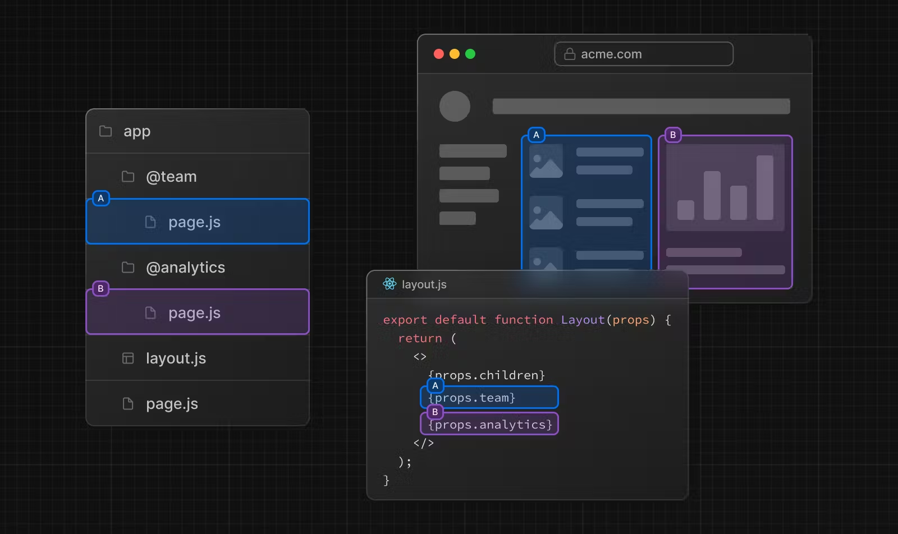
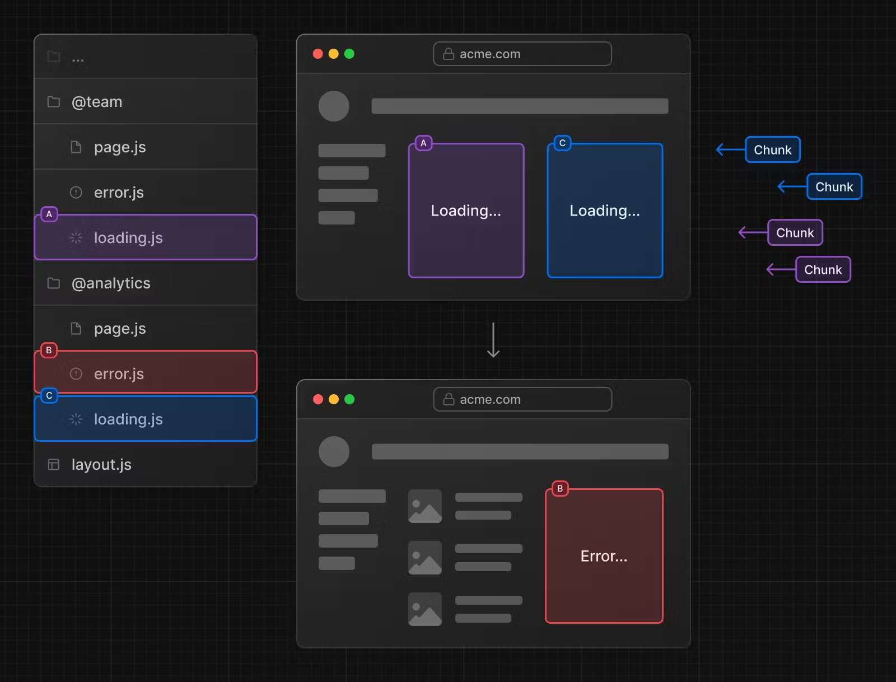
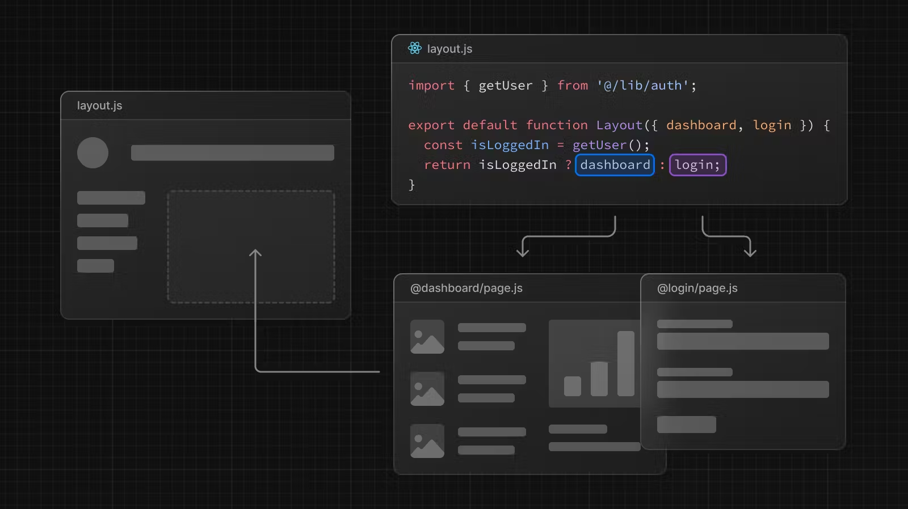
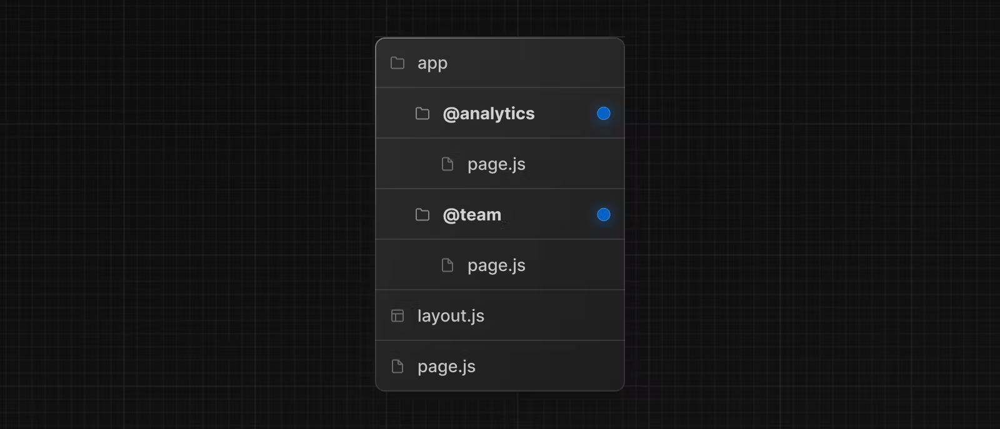
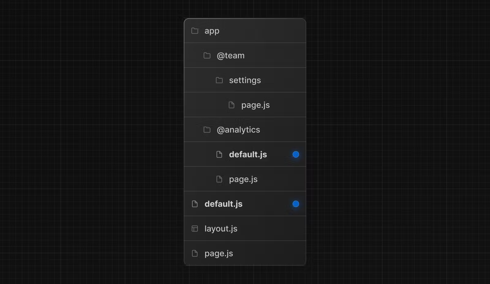
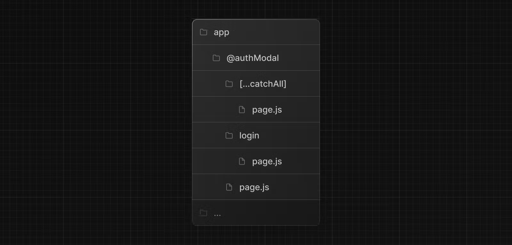

# 병렬 경로 (Parallel Routes)

병렬 경로(Parallel Routes)을 사용하면 동일한 레이아웃에서 하나 이상의 페이지를 동시에 또는 조건부로 렌더링할 수 있습니다. 대시보드 및 소셜 사이트의 피드와 같이 매우 동적인 앱 섹션의 경우 병렬 라우팅을 사용하여 복잡한 라우팅 패턴을 구현할 수 있습니다.

예를 들어 팀 페이지와 분석 페이지를 동시에 렌더링할 수 있습니다.



병렬 경로 사용하면 경로가 독립적으로 스트리밍될 때 각 경로에 대해 독립적인 오류 및 로드 상태를 정의할 수 있습니다.



병렬 경로를 사용하면 인증 상태와 같은 특정 조건에 따라 슬롯을 조건부로 렌더링할 수도 있습니다. 이를 통해 동일한 URL에서 완전히 분리된 코드를 사용할 수 있습니다.



## 협약

병렬 경로는 명명된 슬롯을 사용하여 생성됩니다. 슬롯은 `@folder` 규칙으로 정의되며 props와 동일한 수준 레이아웃에 전달됩니다.

> 슬롯은 경로 세그먼트가 아니며 URL 구조에 영향을 주지 않습니다. `/@team/members` 파일 경로는 `/members`에서 액세스할 수 있습니다.

예를 들어 다음 파일 구조는 `@analytics` 및 `@team`이라는 두 개의 명시적 슬롯을 정의합니다.



위의 폴더 구조는 `app/layout.js`의 구성 요소가 이제 `@analytics` 및 `@team` 슬롯 props를 허용하고 이를 `children` prop과 함께 병렬로 렌더링할 수 있음을 의미합니다.

```tsx
// app/layout.tsx

export default function Layout(props: {
  children: React.ReactNode;
  analytics: React.ReactNode;
  team: React.ReactNode;
}) {
  return (
    <>
      {props.children}
      {props.team}
      {props.analytics}
    </>
  );
}
```

> 알아두면 좋은 점: `children` prop은 폴더에 매핑할 필요가 없는 암시적 슬롯입니다. 이는 `app/page.js`가 `app/@children/page.js`와 동일하다는 것을 의미합니다.

## 매치되지 않는 경로

기본적으로 슬롯 내에서 렌더링되는 콘텐츠는 현재 URL과 일치합니다.

일치하지 않는 슬롯의 경우 Next.js가 렌더링하는 콘텐츠는 라우팅 기술과 폴더 구조에 따라 다릅니다.

### `default.js`

Next.js가 현재 URL을 기반으로 슬롯의 활성 상태를 복구할 수 없는 경우 대체 파일로 렌더링하도록 `default.js` 파일을 정의할 수 있습니다.

다음 폴더 구조를 고려하세요. `@team` 슬롯에는 `settings` 디렉터리가 있지만 `@analytics`에는 없습니다.



### (탐색) Navigation

탐색 시 Next.js는 현재 URL과 일치하지 않더라도 슬롯의 이전 활성 상태를 렌더링합니다.

### (재실행) Reload

다시 로드할 때 Next.js는 먼저 일치하지 않는 슬롯의 `default.js` 파일을 렌더링하려고 시도합니다. 사용할 수 없는 경우 404가 렌더링됩니다.

---

## `useSelectedLayoutSegment(s)`

`useSelectedLayoutSegment` 및 `useSelectedLayoutSegments`는 모두 해당 슬롯 내에서 활성 경로 세그먼트를 읽을 수 있도록 하는 `parallelRoutesKey`를 허용합니다.

```tsx
// app/layout.tsx

"use client";

import { useSelectedLayoutSegment } from "next/navigation";

export default async function Layout(props: {
  //...
  auth: React.ReactNode;
}) {
  const loginSegments = useSelectedLayoutSegment("auth");
  // ...
}
```

사용자가 `@auth/login` 또는 URL 표시줄의 `/login`으로 이동하면 `loginSegments`는 `"login"` 문자열과 같습니다.

---

## 예시

### 모델

병렬 경로를 사용하여 모달을 렌더링할 수 있습니다.


`@auth` 슬롯은 일치하는 경로(예: `/login`)로 이동하여 표시할 수 있는 `<Modal>` 구성 요소를 렌더링합니다.

```tsx
// app/layout.tsx

export default async function Layout(props: {
  // ...
  auth: React.ReactNode;
}) {
  return (
    <>
      {/* ... */}
      {props.auth}
    </>
  );
}
```

```tsx
// app/@auth/login/page.tsx

import { Modal } from "components/modal";

export default function Login() {
  return (
    <Modal>
      <h1>Login</h1>
      {/* ... */}
    </Modal>
  );
}
```

모달이 활성화되지 않은 경우 모달의 콘텐츠가 렌더링되지 않도록 하려면 `null`을 반환하는 `default.js` 파일을 생성하면 됩니다.

```tsx
// app/@auth/default.tsx

export default function Default() {
  return null;
}
```

### 모달 닫기

클라이언트 탐색을 통해 모달이 시작된 경우 `<Link href="/login">`을 사용하면 `router.back()`을 호출하거나 `Link` 컴포넌트를 사용하여 모달을 해제할 수 있습니다.

```tsx
// app/@auth/login/page.tsx

"use client";

import { useRouter } from "next/navigation";
import { Modal } from "components/modal";

export default async function Login() {
  const router = useRouter();
  return (
    <Modal>
      <span onClick={() => router.back()}>Close modal</span>
      <h1>Login</h1>
      ...
    </Modal>
  );
}
```

> 모달에 대한 자세한 내용은 [경로 차단](https://nextjs.org/docs/app/building-your-application/routing/intercepting-routes) 섹션에서 다룹니다.

다른 곳으로 이동하고 모달을 닫으려면 catch-all 경로를 사용할 수도 있습니다.



```tsx
// app/@auth/[...catchAll]/page.tsx

export default function CatchAll() {
  return null;
}
```

Catch-all 경로는 `default.js`보다 우선합니다.

### 조건부 경로

병렬 경로를 사용하여 조건부 경로를 구현할 수 있습니다. 예를 들어 인증 상태에 따라 `@dashboard` 또는 `@login` 경로를 렌더링할 수 있습니다.

```tsx
// app/layout.tsx

import { getUser } from "@/lib/auth";

export default function Layout({
  dashboard,
  login,
}: {
  dashboard: React.ReactNode;
  login: React.ReactNode;
}) {
  const isLoggedIn = getUser();
  return isLoggedIn ? dashboard : login;
}
```


