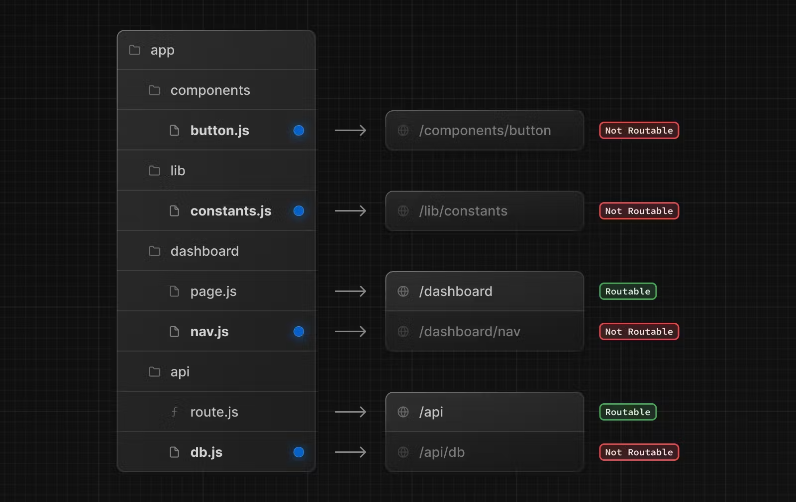
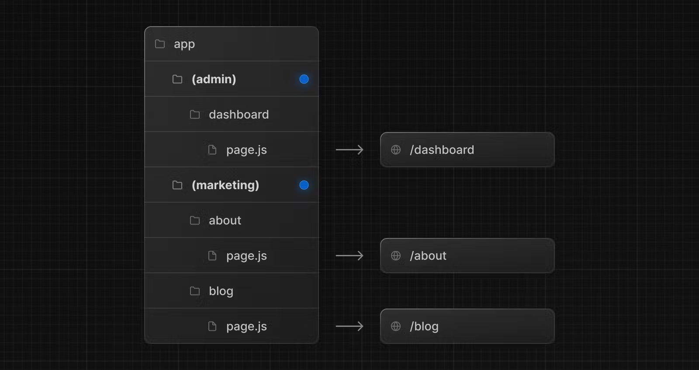
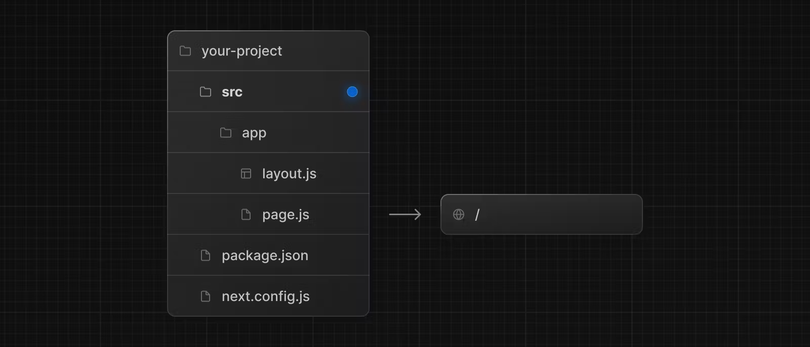
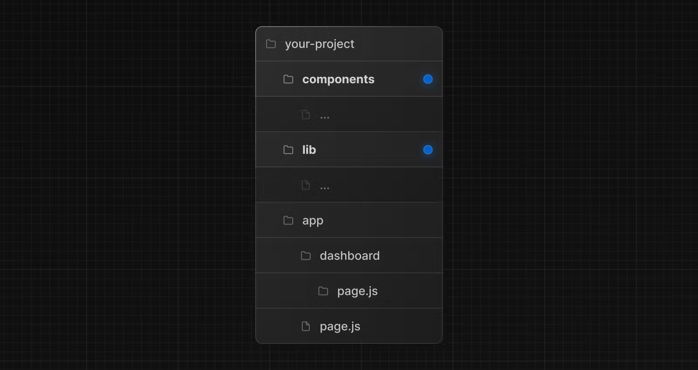
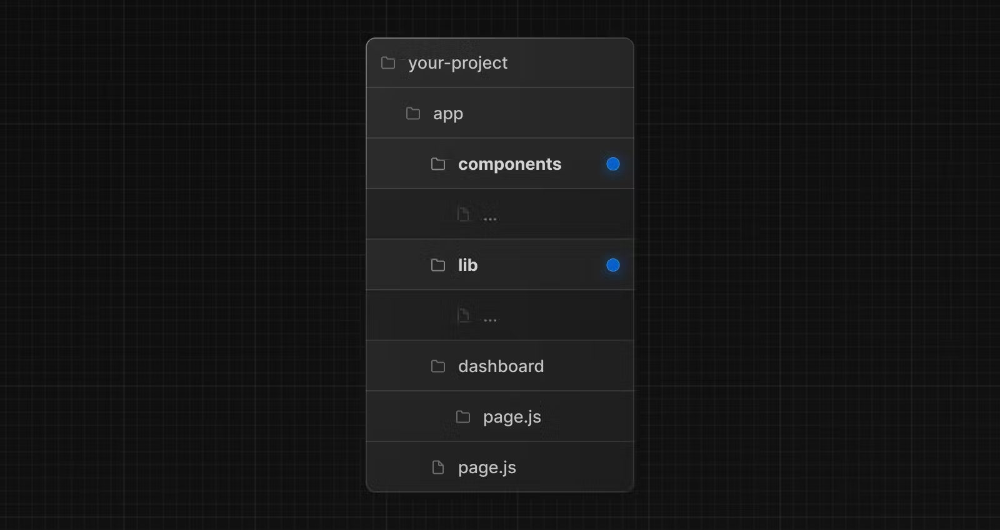
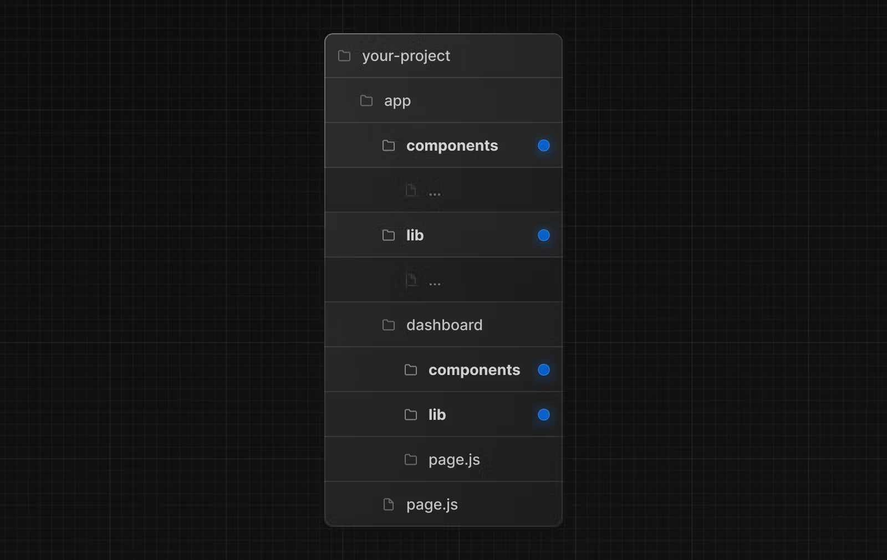

# 프로젝트 구성 및 파일 코로케이션

라우팅 [폴더와 파일 규칙](https://nextjs.org/docs/getting-started/project-structure#app-routing-conventions) 외에도, Next.js는 프로젝트 파일을 구조화하고 코로케이션시키는 방법에 대해 의견을 제시하지 않습니다.

이 페이지에서는 프로젝트를 구조화하는 데 사용할 수 있는 기본 동작과 기능을 소개합니다.

- [Safe colocation by default](https://nextjs.org/docs/app/building-your-application/routing/colocation#safe-colocation-by-default)
- [Project organization features](https://nextjs.org/docs/app/building-your-application/routing/colocation#project-organization-features)
- [Project organization strategies](https://nextjs.org/docs/app/building-your-application/routing/colocation#project-organization-strategies)

---

## 기본적인 안전한 코로케이션

`app` 디렉토리에서 [중첩된 폴더 계층 구조](https://nextjs.org/docs/app/building-your-application/routing#route-segments)가 라우트 구조를 정의합니다.

각 폴더는 URL 경로의 해당 세그먼트에 매핑되는 라우트 세그먼트를 나타냅니다.

그러나 폴더를 통해 라우트 구조가 정의되었더라도, `page.js` 또는 `route.js` 파일이 라우트 세그먼트에 추가되기 전까지는 해당 라우트에는 **공개 접근할 수 없습니다**.


또한, 라우트가 공개 접근 가능해진다고 해도, 클라이언트에 전송되는 것은 `page.js` 또는 `route.js`에서 반환되는 **컨텐츠 뿐입니다**.


이는 `app` 디렉토리의 라우트 세그먼트 내에 실수로 라우팅되는 파일 없이 **프로젝트 파일**을 **안전하게 코로케이션 시킬 수** 있다는 것을 의미합니다.



> **참고**:
>
> - 이는 `pages` 디렉토리와는 다릅니다. `pages`의 모든 파일은 라우트로 간주됩니다.
> - `app` 디렉토리에 프로젝트 파일을 **공존시킬 수는 있지만** 그럴 **필요는 없습니다**. 원하는 경우 [`app` 디렉토리 외부에 유지할 수도 있습니다](#store-project-files-outside-of-app).

## 프로젝트 구조화 기능

Next.js는 프로젝트를 구조화하는 데 도움이 되는 여러 기능을 제공합니다.

### 비공개 폴더

비공개 폴더는 언더스코어(\_)를 접두사로 사용하여 생성할 수 있습니다: `_folderName`

이는 해당 폴더가 비공개 구현 세부 정보이며 라우팅 시스템에서 고려되지 않아야 함을 나타냅니다. 따라서 **해당 폴더와 모든 하위 폴더**는 라우팅에서 제외됩니다.


`app` 디렉토리의 파일은 [기본적으로 안전하게 코로케이션 되므로](#safe-colocation-by-default) 비공개 폴더는 코로케이션에 필요하지 않습니다. 그러나 다음과 같은 경우에 유용할 수 있습니다:

- UI 로직과 라우팅 로직을 분리하고 싶은 경우.
- 프로젝트 및 Next.js 생태계 전체에서 내부 파일을 일관되게 구조화하고 싶을 경우.
- 에디터에서 파일을 정렬하고 그룹화하고 싶을 경우.
- 향후 Next.js 파일 규칙과의 잠재적인 이름 충돌을 피하고 싶을 경우.

> **참고**
>
> - 프레임워크 규칙은 아니지만, 동일한 언더스코어 패턴을 사용하여 비공개 폴더 외부의 파일을 "비공개"로 표시하는 것도 고려할 수 있습니다.
> - 언더스코어(\_)로 시작하는 URL 세그먼트를 만들려면 폴더 이름에 %5F (언더스코어의 URL 인코딩된 형식)를 접두사로 사용하면 됩니다: `%5F폴더명`.
> - 비공개 폴더를 사용하지 않는 경우 [Next.js 특수 파일 규칙](/docs/getting-started/project-structure#routing-files)을 알아두면 예기치 않은 이름 충돌을 방지하는 데 도움이 됩니다.

### 라우트 그룹

라우트 그룹은 폴더를 괄호로 감싸면 `(folderName)`을 생성하여 만들 수 있습니다.

이는 해당 폴더가 프로젝트 구조화를 목적으로 사용되며 라우트의 URL 경로에 **포함되지 않아야 함**을 나타냅니다.



라우트 그룹은 다음과 같은 경우에 유용하게 사용할 수 있습니다:

- [URL 경로에 영향을 주지 않고 라우트를 그룹화하고 싶을 경우](https://nextjs.org/docs/app/building-your-application/routing/route-groups#organize-routes-without-affecting-the-url-path) 예: 사이트 섹션, 의도, 팀별로 그룹화합니다.
- 동일한 라우트 세그먼트 수준에서 중첩된 레이아웃을 활성화할 수 있습니다:
  - [동일한 세그먼트에서 루트 레이아웃을 포함하여 중첩된 레이아웃을 생성할 경우](https://nextjs.org/docs/app/building-your-application/routing/route-groups#creating-multiple-root-layouts)
  - [일부 라우트에 레이아웃을 추가할 경우](https://nextjs.org/docs/app/building-your-application/routing/route-groups#opting-specific-segments-into-a-layout)

### `src` 디렉토리

Next.js는 옵션으로 [`src` 디렉토리](https://nextjs.org/docs/app/building-your-application/configuring/src-directory) 내에 응용 프로그램 코드(`app` 디렉토리를 포함하여)를 저장할 수 있도록 지원합니다. 이를 통해 어플리케이션 코드를 프로젝트의 주요 설정 파일과 분리할 수 있습니다.



### 모듈 경로 별칭

Next.js는 [모듈 경로 별칭](https://nextjs.org/docs/app/building-your-application/configuring/absolute-imports-and-module-aliases)을 지원하여 깊게 중첩된 프로젝트 파일에서 임포트를 더 쉽게 읽고 유지할 수 있게 해줍니다.

```jsx
// app/dashboard/settings/analytics/page.js

// before
import { Button } from "../../../components/button";

// after
import { Button } from "@/components/button";
```

---

## 프로젝트 구조화 전략

Next.js 프로젝트에서 파일과 폴더를 조직하는 방법에는 "옳은" 방법 또는 "잘못된" 방법이 없습니다.

다음 섹션에서는 일반적인 전략에 대한 매우 고수준의 개요를 제공합니다. 가장 간단한 결론은 자신과 팀에게 맞는 전략을 선택하고 프로젝트 전체에서 일관성을 유지하는 것입니다.

> **참고**: 아래 예제에서는 components 및 lib 폴더를 일반화된 플레이스홀더로 사용하고 있으며, 이들 이름은 특별한 의미를 가지고 있지 않으며, 프로젝트에서 ui, utils, hooks, styles 등과 같은 다른 폴더를 사용할 수도 있습니다.

### `app` 디렉토리 외부에 프로젝트 파일 저장

이 전략은 모든 어플리케이션 코드를 프로젝트의 **루트에 있는 공유 폴더**에 저장하고, `app` 디렉토리를 단순히 라우팅 목적으로 사용합니다.



### `app` 디렉토리 내부의 최상위 폴더에 프로젝트 파일 저장

이 전략은 모든 어플리케이션 코드를 **app 디렉토리의 루트**에 있는 공유 폴더에 저장합니다.



### 기능 또는 라우트별로 프로젝트 파일 분할

이 전략은 전역으로 공유되는 어플리케이션 코드를 `app` 디렉토리의 루트에 저장하고, 더 구체적인 어플리케이션 코드를 사용하는 경로 세그먼트별로 **분할합니다**.


