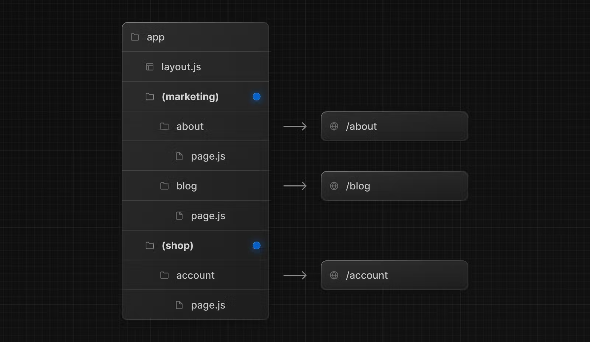
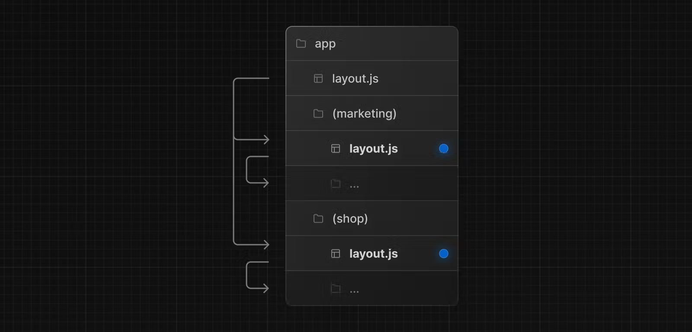
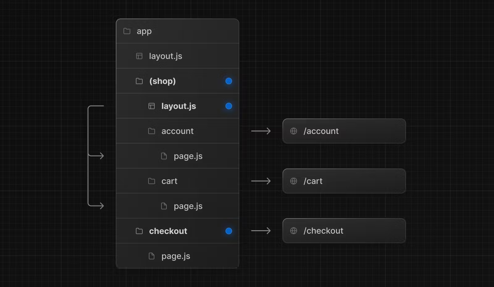
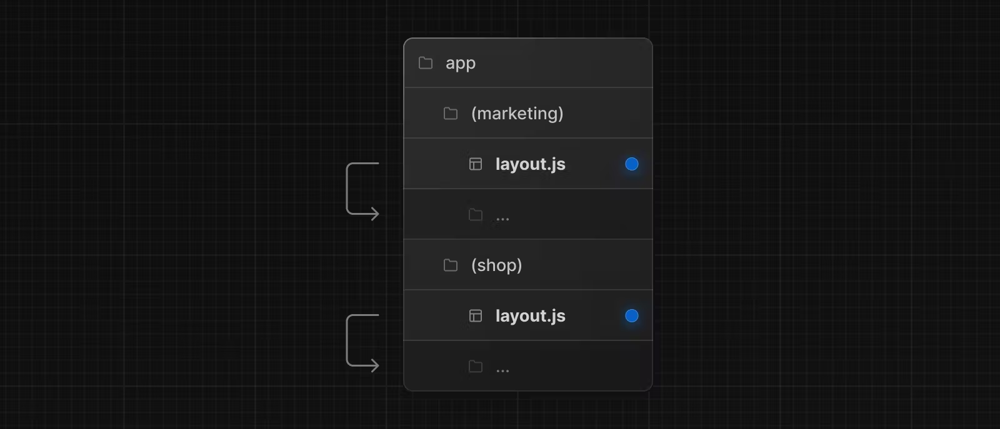

# 경로 그룹

`app` 디렉터리에서 중첩된 폴더는 일반적으로 URL 경로에 매핑됩니다. 그러나 폴더가 경로의 URL 경로에 포함되지 않도록 폴더를 경로 그룹으로 표시할 수 있습니다.

이를 통해 URL 경로 구조에 영향을 주지 않고 경로 세그먼트와 프로젝트 파일을 논리 그룹으로 구성할 수 있습니다.

경로 그룹은 다음과 같은 경우에 유용합니다.

- [경로를 그룹으로 구성합니다](https://nextjs.org/docs/app/building-your-application/routing/route-groups#organize-routes-without-affecting-the-url-path) 사이트 섹션, 의도 또는 팀별.
- 동일한 경로 구간 수준에서 [중첩 레이아웃](https://nextjs.org/docs/app/building-your-application/routing/pages-and-layouts) 활성화:
  - [여러 루트 레이아웃을 포함하여 동일한 세그먼트에 여러 중첩 레이아웃 만들기](https://nextjs.org/docs/app/building-your-application/routing/route-groups#creating-multiple-root-layouts)
  - [공통 구간의 경로 하위 집합에 레이아웃 추가](https://nextjs.org/docs/app/building-your-application/routing/route-groups#opting-specific-segments-into-a-layout)

---

## 협약 (Convention)

경로 그룹은 폴더 이름을 괄호로 묶어 생성할 수 있습니다.

`(folderName)`

---

## 예시

### URL 경로에 영향을 주지 않고 경로 구성

URL 경로에 영향을 주지 않고 경로를 구성하려면 관련 경로를 함꼐 유지하는 그룹을 만드세요. 괄호 안의 폴더는 URL(예:`(marketing)` 혹은 `(shop)`)에서 생략이 될 것입니다.

`(marketing)` 및 `(shop)` 내부 경로가 같은 URL 계층 구조를 공유하더라도 해당 폴더 내 `layout.js` 파일을 추가하여 각 그룹마다 다른 레이아웃을 만들 수 있습니다.

### 특정 경로를 레이아웃으로 선택

특정 경로를 레이아웃으로 선택하려면 새 경로 그룹(예. `(shop)`)을 만들고 동일한 레이아웃을 공유하는 경로를 그룹(예: `account`과 `cart`)으로 이동합니다. 그룹 외부의 경로는 레이아웃(예. `checkout`)고 공유하지 않습니다.

### 여러 루트 레이아웃 생성

여러 [루트 레이아웃](https://nextjs.org/docs/app/building-your-application/routing/pages-and-layouts#root-layout-required)을 생성하려면 최상위 `layout.js` 파일을 제거하고 각 경로 그룹 내에 `layout.js` 파일을 추가합니다. 이것은 완전히 다른 UI나 경험을 가진 섹션으로 어플리케이션을 분활하는데 유용합니다. `<html>` 그리고 `<body>` 태그는 각 루트 레이아웃에 추가해야 합니다.

위의 예에서 `(marketing)`과 `(shop)`은 모두 자체 루트 레이아웃을 가지고 있습니다.

> 알아두면 좋은 점:
>
> - 경로 그룹의 이름은 조직을 위한 것 외에는 특별한 의미가 없습니다. URL 경로에는 영향을 주지 않습니다.
> - 경로 그룹을 포함한 경로는 다른 경로와 동일한 URL 경로로 해석되어서는 안 됩니다. 예를 들어 경로 그룹이 URL 구조에 영향을 주지 않기 때문에, `(marketing)/about/page.js` 그리고 `(shop)/about/page.js`는 모두 `/about`으로 확인되어 오류를 발생시킵니다.
> - 최상위 `layout.js` 파일 없이 여러 루트 레이아웃을 사용하는 경우 home `page.js` 파일은 경로 그룹 중 하나에 정의되어야 합니다(예: `app/(marketing)/page.js`).
> - 여러 루트 레이아웃을 탐색하면 전체 페이지 로드가 발생합니다(클라이언트 측 탐색과 반대). 예를 들어 `app/(shop)/layout.js`를 사용하는 `/cart`에서 `app/(marketing)/layout.js`를 사용하는 `/blog`로 이동하면 전체 페이지 로드가 발생합니다.
