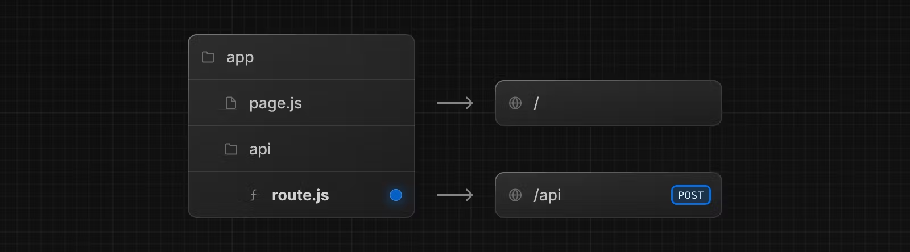

# 라우트 핸들러

라우트 핸들러를 사용하면 웹 [요청](https://developer.mozilla.org/docs/Web/API/Request) 및 [응답](https://developer.mozilla.org/docs/Web/API/Response) API를 사용하여 특정 경로에 대한 사용자 정의 요청 핸들러를 생성할 수 있습니다.



> **참고**: 경로 처리기는 `app` 디렉터리 내에서만 사용할 수 있습니다. `pages` 디렉터리 내부의 [API 경로](https://nextjs.org/docs/pages/building-your-application/routing/api-routes)와 동일하므로 API 경로와 경로 처리기를 함께 사용할 필요가 없습니다.

---

## 협약

라우트 핸들러는 `app` 디렉터리 내의 [`route.js|ts` 파일](https://nextjs.org/docs/app/api-reference/file-conventions/route)에 정의되어 있습니다.

```ts
// app/api/route.ts

export async function GET(request: Request) {}
```

경로 핸들러는 `page.js` 및 `layout.js`와 유사하게 `app` 디렉터리 내에 중첩될 수 있습니다. 그러나 `page.js`와 동일한 경로 세그먼트 수준에는 `route.js` 파일이 있을 수 없습니다.

### 지원되는 HTTP 메소드

`GET`, `POST`, `PUT`, `PATCH`, `DELETE`, `HEAD` 및 `OPTIONS`와 같은 [HTTP 메서드](https://developer.mozilla.org/docs/Web/HTTP/Methods)가 지원됩니다. 지원되지 않는 메서드가 호출되면 Next.js는 `405 Method Not Allowed` 응답을 반환합니다.

### 확장된 `NextRequest` 및 `NextResponse` API

기본 [요청](https://developer.mozilla.org/docs/Web/API/Request) 및 [응답](https://developer.mozilla.org/docs/Web/API/Response)을 지원하는 것 외에도. Next.js는 이를 [`NextRequest`](https://nextjs.org/docs/app/api-reference/functions/next-request) 및 [`NextResponse`](https://nextjs.org/docs/app/api-reference/functions/next-response)로 확장하여 고급 사용 사례에 편리한 도우미를 제공합니다.

---

## 행동

### 캐싱

라우트 핸들러는 응답 객체와 함께 `GET` 메서드를 사용할 때 기본적으로 캐시됩니다.

```ts
// app/items/route.ts

export async function GET() {
  const res = await fetch("https://data.mongodb-api.com/...", {
    headers: {
      "Content-Type": "application/json",
      "API-Key": process.env.DATA_API_KEY,
    },
  });
  const data = await res.json();

  return Response.json({ data });
}
```

> TypeScript 경고: `Response.json()`은 TypeScript 5.2에서만 유효합니다. 더 낮은 TypeScript 버전을 사용하는 경우 입력된 응답에 대신 [`NextResponse.json()`](https://nextjs.org/docs/app/api-reference/functions/next-response#json)을 사용할 수 있습니다.

### 캐싱 선택 해제

다음 방법으로 캐싱을 선택 해제할 수 있습니다:

- `GET` 메소드와 함께 `Request` 객체를 사용합니다.
- 다른 HTTP 메서드를 사용합니다.
- `cookies` 및 `headers`와 같은 [동적 기능](https://nextjs.org/docs/app/building-your-application/routing/route-handlers#dynamic-function)을 사용합니다.
- [세그먼트 구성 옵션](https://nextjs.org/docs/app/building-your-application/routing/route-handlers#segment-config-options)은 동적 모드를 수동으로 지정합니다.

예를 들어:

```ts
// app/products/api/route.ts

export async function GET(request: Request) {
  const { searchParams } = new URL(request.url);
  const id = searchParams.get("id");
  const res = await fetch(`https://data.mongodb-api.com/product/${id}`, {
    headers: {
      "Content-Type": "application/json",
      "API-Key": process.env.DATA_API_KEY,
    },
  });
  const product = await res.json();

  return Response.json({ product });
}
```

마찬가지로 `POST` 메서드는 라우트 핸들러가 동적으로 평가되도록 합니다.

```ts
// app/items/route.ts

export async function POST() {
  const res = await fetch("https://data.mongodb-api.com/...", {
    method: "POST",
    headers: {
      "Content-Type": "application/json",
      "API-Key": process.env.DATA_API_KEY,
    },
    body: JSON.stringify({ time: new Date().toISOString() }),
  });

  const data = await res.json();

  return Response.json(data);
}
```

> **참고**: API 경로와 마찬가지로 경로 핸들러는 양식 제출 처리와 같은 경우에 사용할 수 있습니다. React와 깊이 통합되는 형태와 변형을 처리하기 위한 새로운 추상화가 작업 중입니다.

### 라우트 결정

`route`를 가장 낮은 수준의 라우팅 기본 요소로 간주할 수 있습니다.

- `page`와 같은 레이아웃이나 클라이언트 측 탐색에는 참여하지 않습니다.
- `page.js`와 동일한 경로에 `route.js` 파일이 있을 수 없습니다.

| 페이지               | 라우트             | 결과 |
| -------------------- | ------------------ | ---- |
| `app/page.js`        | `app/route.js`     | 충돌 |
| `app/page.js`        | `app/api/route.js` | 유효 |
| `app/[user]/page.js` | `app/api/route.js` | 유효 |

각 `route.js` 또는 `page.js` 파일은 해당 경로에 대한 모든 HTTP 동사를 인수합니다.

```js
// app/page/js

export default function Page() {
  return <h1>Hello, Next.js!</h1>;
}

// ❌ Conflict
// `app/route.js`
export async function POST(request) {}
```

---

## 예시

다음 예에서는 경로 핸들러를 다른 Next.js API 및 기능과 결합하는 방법을 보여줍니다.

### 캐시된 데이터 재검증

[`next.revalidate`](https://nextjs.org/docs/app/building-your-application/data-fetching/fetching-caching-and-revalidating#revalidating-data) 옵션을 사용하여 [캐시된 데이터의 유효성](https://nextjs.org/docs/app/building-your-application/data-fetching/fetching-caching-and-revalidating#revalidating-data)을 다시 검사할 수 있습니다.

```ts
// app/items/route.ts

export async function GET() {
  const res = await fetch("https://data.mongodb-api.com/...", {
    next: { revalidate: 60 }, // Revalidate every 60 seconds
  });
  const data = await res.json();

  return Response.json(data);
}
```

또는 [세그먼트 구성 `revalidate` 옵션](https://nextjs.org/docs/app/api-reference/file-conventions/route-segment-config#revalidate)을 사용할 수 있습니다.

```js
export const revalidate = 60;
```

### 동적 기능

라우트 핸들러는 [`cookies`](https://nextjs.org/docs/app/api-reference/functions/cookies) 및 [`headers`](https://nextjs.org/docs/app/api-reference/functions/headers) 같은 Next.js의 동적 기능과 함께 사용할 수 있습니다.

#### 쿠키

`next/headers`에서 [`cookies`](https://nextjs.org/docs/app/api-reference/functions/cookies)를 사용하여 쿠키를 읽을 수 있습니다. 이 서버 함수는 라우트 핸들러에서 직접 호출되거나 다른 함수 내에 중첩될 수 있습니다.

이 `cookies` 인스턴스는 읽기 전용입니다. 쿠키를 설정하려면 [Set-Cookie](https://developer.mozilla.org/docs/Web/HTTP/Headers/Set-Cookie) 헤더를 사용하여 새 `Response`을 반환해야 합니다.

```ts
// app/api/routes.ts

import { cookies } from "next/headers";

export async function GET(request: Request) {
  const cookieStore = cookies();
  const token = cookieStore.get("token");

  return new Response("Hello, Next.js!", {
    status: 200,
    headers: { "Set-Cookie": `token=${token.value}` },
  });
}
```

또는 기본 웹 API 위에 추상화를 사용하여 쿠키를 읽을 수 있습니다([`NextRequest`](https://nextjs.org/docs/app/api-reference/functions/next-request)).

```ts
// app/api/route.ts

import { type NextRequest } from "next/server";

export async function GET(request: NextRequest) {
  const token = request.cookies.get("token");
}
```

#### 헤더

`next/headers`에서 헤더가 포함된 `headers`를 읽을 수 있습니다. 이 서버 함수는 Route Handler에서 직접 호출되거나 다른 함수 내에 중첩될 수 있습니다.

이 `headers` 인스턴스는 읽기 전용입니다. 헤더를 설정하려면 새 `headers`가 포함된 새 `Response`을 반환해야 합니다.

```ts
// app/api/route.ts

import { headers } from "next/headers";

export async function GET(request: Request) {
  const headersList = headers();
  const referer = headersList.get("referer");

  return new Response("Hello, Next.js!", {
    status: 200,
    headers: { referer: referer },
  });
}
```

또는 기본 웹 API 위에 추상화를 사용하여 헤더를 읽을 수 있습니다([`NextRequest`](https://nextjs.org/docs/app/api-reference/functions/next-request)).

```ts
import { type NextRequest } from "next/server";

export async function GET(request: NextRequest) {
  const requestHeaders = new Headers(request.headers);
}
```

### 리디렉트 (Redirects)

```ts
// app/api/routes.ts

import { redirect } from "next/navigation";

export async function GET(request: Request) {
  redirect("https://nextjs.org/");
}
```

### 동적 라우트 세그먼트

> 계속하기 전에 [라우트 정의](https://nextjs.org/docs/app/building-your-application/routing/defining-routes) 페이지를 읽어보는 것이 좋습니다.

경로 핸들러는 [동적 세그먼트](https://nextjs.org/docs/app/building-your-application/routing/dynamic-routes)를 사용하여 동적 데이터에서 요청 핸들러를 생성할 수 있습니다.

```ts
// app/items/[slug]/route.ts

export async function GET(
  request: Request,
  { params }: { params: { slug: string } }
) {
  const slug = params.slug; // 'a', 'b', or 'c'
}
```

| 라우트                    | 예시 URL  | `params`        |
| ------------------------- | --------- | --------------- |
| `app/blog/[slug]/page.js` | `/blog/a` | `{ slug: 'a' }` |
| `app/blog/[slug]/page.js` | `/blog/b` | `{ slug: 'b' }` |
| `app/blog/[slug]/page.js` | `/blog/c` | `{ slug: 'c' }` |

### URL 쿼리 매개변수

라우트 핸들러에 전달된 요청 객체는 쿼리 매개변수를 더 쉽게 처리하는 것을 포함하여 [몇 가지 추가 편의 메서드](https://nextjs.org/docs/app/api-reference/functions/next-request#nexturl)가 있는 `NextRequest` 인스턴스입니다.

```ts
// app/api/route.ts

import { type NextRequest } from "next/server";

export function GET(request: NextRequest) {
  const searchParams = request.nextUrl.searchParams;
  const query = searchParams.get("query");
  // query is "hello" for /api/search?query=hello
}
```

### 스트리밍

스트리밍은 AI 생성 콘텐츠를 위해 OpenAI와 같은 LLM(대형 언어 모델)과 함께 일반적으로 사용됩니다. [AI SDK](https://sdk.vercel.ai/docs)에 대해 자세히 알아보세요.

```ts
// app/api/chat/route.ts

import { Configuration, OpenAIApi } from "openai-edge";
import { OpenAIStream, StreamingTextResponse } from "ai";

export const runtime = "edge";

const apiConfig = new Configuration({
  apiKey: process.env.OPENAI_API_KEY!,
});

const openai = new OpenAIApi(apiConfig);

export async function POST(req: Request) {
  // Extract the `messages` from the body of the request
  const { messages } = await req.json();

  // Request the OpenAI API for the response based on the prompt
  const response = await openai.createChatCompletion({
    model: "gpt-3.5-turbo",
    stream: true,
    messages: messages,
    max_tokens: 500,
    temperature: 0.7,
    top_p: 1,
    frequency_penalty: 1,
    presence_penalty: 1,
  });

  // Convert the response into a friendly text-stream
  const stream = OpenAIStream(response);

  // Respond with the stream
  return new StreamingTextResponse(stream);
}
```

이러한 추상화는 웹 API를 사용하여 스트림을 생성합니다. 기본 웹 API를 직접 사용할 수도 있습니다.

```ts
// app/api/toute.ts

// https://developer.mozilla.org/docs/Web/API/ReadableStream#convert_async_iterator_to_stream
function iteratorToStream(iterator: any) {
  return new ReadableStream({
    async pull(controller) {
      const { value, done } = await iterator.next();

      if (done) {
        controller.close();
      } else {
        controller.enqueue(value);
      }
    },
  });
}

function sleep(time: number) {
  return new Promise((resolve) => {
    setTimeout(resolve, time);
  });
}

const encoder = new TextEncoder();

async function* makeIterator() {
  yield encoder.encode("<p>One</p>");
  await sleep(200);
  yield encoder.encode("<p>Two</p>");
  await sleep(200);
  yield encoder.encode("<p>Three</p>");
}

export async function GET() {
  const iterator = makeIterator();
  const stream = iteratorToStream(iterator);

  return new Response(stream);
}
```

### 요청 본문

표준 웹 API 메서드를 사용하여 요청 본문을 읽을 수 있습니다.

```ts
// app/items/route.ts

export async function POST(request: Request) {
  const res = await request.json();
  return Response.json({ res });
}
```

### 요청 본문 양식 데이터

`request.formData()` 함수를 사용하여 `FormData`를 읽을 수 있습니다.

```ts
// app/items/route.ts

export async function POST(request: Request) {
  const formData = await request.formData();
  const name = formData.get("name");
  const email = formData.get("email");
  return Response.json({ name, email });
}
```

`formData` 데이터는 모두 문자열이므로 [`zod-form-data`](https://www.npmjs.com/zod-form-data)를 사용하여 요청을 검증하고 원하는 형식(예: `number`)으로 데이터를 검색할 수 있습니다.

### CORS

표준 웹 API 메서드를 사용하여 응답에 CORS 헤더를 설정할 수 있습니다.

```ts
// app/api/route.ts

export async function GET(request: Request) {
  return new Response("Hello, Next.js!", {
    status: 200,
    headers: {
      "Access-Control-Allow-Origin": "*",
      "Access-Control-Allow-Methods": "GET, POST, PUT, DELETE, OPTIONS",
      "Access-Control-Allow-Headers": "Content-Type, Authorization",
    },
  });
}
```

### Edge 및 Node.js 런타임

경로 처리기에는 스트리밍 지원을 포함하여 Edge 및 Node.js 런타임을 모두 원활하게 지원하는 동형 웹 API가 있습니다. 경로 핸들러는 페이지 및 레이아웃과 동일한 [경로 세그먼트 구성](https://nextjs.org/docs/app/api-reference/file-conventions/route-segment-config)을 사용하므로 범용 [정적으로 재생성된](https://nextjs.org/docs/app/building-your-application/data-fetching/fetching-caching-and-revalidating#revalidating-data) 경로 핸들러와 같이 오랫동안 기다려온 기능을 지원합니다.

`runtime` 세그먼트 구성 옵션을 사용하여 런타임을 지정할 수 있습니다.

```js
export const runtime = "edge"; // 'nodejs' is the default
```

### 비 UI 응답

경로 처리기를 사용하여 UI가 아닌 콘텐츠를 반환할 수 있습니다. [`sitemap.xml`](https://nextjs.org/docs/app/api-reference/file-conventions/metadata/sitemap#generate-a-sitemap), [`robots.txt`](https://nextjs.org/docs/app/api-reference/file-conventions/metadata/robots#generate-a-robots-file), [`app icons`](https://nextjs.org/docs/app/api-reference/file-conventions/metadata/app-icons#generate-icons-using-code-js-ts-tsx) 및 [오픈 그래프 이미지](https://nextjs.org/docs/app/api-reference/file-conventions/metadata/opengraph-image)는 모두 기본적으로 지원됩니다.

```ts
// app/rss.xml/route.ts

export async function GET() {
  return new Response(`<?xml version="1.0" encoding="UTF-8" ?>
<rss version="2.0">
 
<channel>
  <title>Next.js Documentation</title>
  <link>https://nextjs.org/docs</link>
  <description>The React Framework for the Web</description>
</channel>
 
</rss>`);
}
```

### 세그먼트 구성 옵션

라우트 핸들러는 페이지 및 레이아웃과 동일한 [경로 세그먼트 구성](https://nextjs.org/docs/app/api-reference/file-conventions/route-segment-config)을 사용합니다.

```ts
// app/items/route.ts

export const dynamic = "auto";
export const dynamicParams = true;
export const revalidate = false;
export const fetchCache = "auto";
export const runtime = "nodejs";
export const preferredRegion = "auto";
```

자세한 내용은 [API 참조](https://nextjs.org/docs/app/api-reference/file-conventions/route-segment-config)를 확인하세요.
